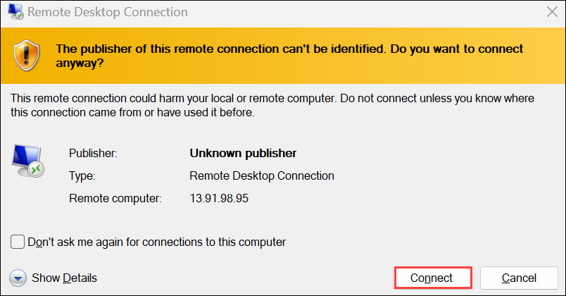
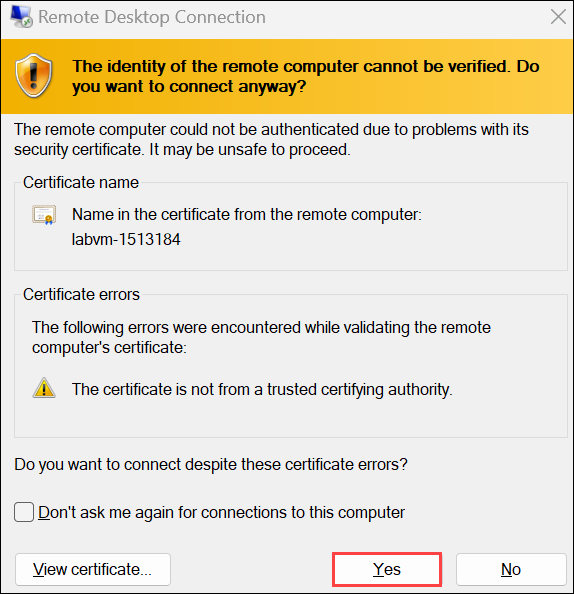

# Lab 01 - Create a Virtual Machine in the Portal

### Estimated Timing: 30 Minutes

## Lab Overview

An Azure virtual machine (VM) is a computing resource provided by Microsoft Azure. It allows users to create and use virtualized computing instances in the cloud. Azure Virtual Machines enable users to run applications, host websites, and perform various computing tasks without needing to purchase and maintain physical hardware.

In this walkthrough, we will create a virtual machine in the Azure Portal, connect to the virtual machine, install the web server role, and test.

## Lab Objectives

In this lab, you will be able to complete the following tasks:

+ **Task 1:** Create a virtual machine
+ **Task 2:** Connect to the virtual machine
+ **Task 3:** Host a basic website on your new cloud VM

## Architecture Diagram

 

**Note**: Take time during this walkthrough to click and read the informational icons.

### Task 1: Create a Virtual Machine

In this task, we will create a Windows Server 2019 Datacenter - Gen2 virtual machine. 

1. On the **Azure Portal** page, in the **Search Resources, Services, and Docs** (G+/) box at the top, enter **Virtual machines (1)**, and then select **Virtual machines (2)** under **Services**.

    

1. On the **Virtual machines** blade, click on **+ Create (1)** and choose **Azure virtual machine (2)**.

     

1. On the **Basics** tab, fill in the following information (leave the defaults for everything else), then click on **Next: Disks (12)**

    | Settings | Values |
    |  -- | -- |
    | Subscription | **Accept default subscription** (1)|
    | Resource group | **AZ-900-<inject key="DeploymentID" enableCopy="false"/>** (2) |
    | Virtual machine name | **myVm** (3)|
    | Region | Select **<inject key="Region" enableCopy="false" />** (4)|
    | Image | **Windows Server 2019 Datacenter - x64 Gen2** (5)|
    | Size | **Standard_D2s_v3** (6)|
    | Administrator account username | **azureuser** (7)|
    | Administrator account password | **Pa$$w0rd1234** (8)|
    | Confirm password | **Pa$$w0rd1234** (9) |
    | Public Inbound ports  | **Allow selected ports** (10)|
    | Select inbound ports | **RDP (3389)** and **HTTP (80)** (11)|
    |||
   
    
   
    

1. Click on **Next : Disks >** to switch to the **Disks** tab. In the **OS Disk type,** select **Standard HDD** from the dropdown and leave everything else as default. Finally, click on **Next : Networking >**. 

   

1. Within the **Networking** tab, look for the **Select inbound ports** option:

    | Setting | Value |
    | -- | -- |
    | Select inbound ports | **HTTP (80), RDP (3389)**|

        
   
    >**Note:** Verify that both port 80 and 3389 are selected.

1. Click on **Next : Management >** to switch to the **Management** tab and leave everything as default.

1. Click on **Next : Monitoring >** to switch to the **Monitoring** tab, select the following setting:

    | Setting | Value |
    | -- | -- |
    | Boot diagnostics | **Disable**|

            
  
1. Leave the remaining as default and then click on the **Review + create** button at the bottom of the page.

1. Once validation is passed, click on the **Create** button. It will take around five to seven minutes for the virtual machine to get deployed.

    

1. You will receive updates on the deployment page and via the **Notifications** area (the bell icon in the top menu).

   >**Note**: Here is the reference link for the virtual machine: https://azure.microsoft.com/en-in/resources/cloud-computing-dictionary/what-is-a-virtual-machine/

### Task 2: Connect to the Virtual Machine

In this task, we will connect to our new virtual machine using RDP. 

1. Once the deployment is complete, click on the **Go to resource** option. You will be redirected to the newly created virtual machine's page.

    
   
1. Click on the **Connect** option and choose **Connect** from the dropdown menu on the virtual machine **Overview** blade.

    

    >**Note:** The following directions tell you how to connect to your VM from a Windows computer. On a Mac, you need an RDP client such as this: Remote Desktop Client from the Mac App Store, and on a Linux computer, you can use an open-source RDP client.

1. Within the **Connect** page, click on the **Download RDP File** option.

   

1. Once the file is downloaded, you will be directed with a warning: Click on **Keep**.

1. **Open** the downloaded RDP file and click on **Connect** when prompted. 

    

1. In the **Windows Security** window, select **More choices (1)** and then choose **Use a different account (2)**. Provide the **User Name** as `.\azureuser` **(3)** and the **Password** `Pa$$w0rd1234` **(4)**. Then click on **OK (5)** to connect.

    

1. You may receive a certificate warning during the sign-in process. Click on **Yes** to create the connection and connect to your deployed VM. You should be able to connect successfully.

    

### Task 3: Host a Basic Website on your New Azure Cloud VM

In this task, you will install the web server role on the server and host a basic website.

1. In the **Server Manager** (which should launch automatically), once you connect to the VM, select **Add roles and features** as shown below in the screenshot: 

    

    >**Note:** If you get a pop-up related to **Networking** click **No**. If you get to see a **Server Manager** tab, close the same.
    
    

1. Within the **Before you Begin** page, click on **Next >**.

1. Ensure **Role-based or feature-based installation** is selected. Click on **Next >**.

1. Ensure **Select a server from the server pool (1)** is selected and that your VM appears **(2)** in the list below. Click on **Next > (3)**.

    

1. In the server **Roles** list, scroll down to the bottom of the list and select **Web Server (IIS) (1)**. Click on **Add Features (2)**.

    

1. Click on **Next >** until you reach the **Confirm installation selections** page, and make sure that the **Restart the destination server automatically if required (1)** is checked. Then click on **Install (2)**.

    

    >**Note:** If a pop-up appears warning about the automatic server restart, select **Yes**.

1. When the installation completes, click on **Close**. Back on the **Server Manager** portal, go to **Tools** > **Internet Information Services (IIS) Manager**.

    

1. In the **Internet Information Services (IIS)** **Manager** window, locate your server’s **Default Web Site** in the **Connections** tree.

    

1. Now, click on **Basic Settings** in the **Actions** menu. In the new pop-up dialog box, locate the **Physical Path** and click **Ok**. This is where you will put your website HTML file.

    

   >**Note:** Keep a note of the path as it will be required in the preceding steps.

1. Go to the **Physical Path** location specified in the **Basic** settings. Navigate `File explore` from the bottom, then copy and paste the **iisstart.html** file in the same location. Rename the new file to **Default**. Right-click on the **Default.html** file, click on **Open With > Notepad**, and delete the existing content. Then paste the below code into the same file and save the file.

   >**Note**: If you have trouble copying **iisstart.html**, select the **iisstart.html** and use **Ctrl + C** to copy and **Ctrl + V** to paste it.

    ```
    <html>
    <body>
        <h1>Demo Website</h1>
        <p>This is my first cloud hosted website.</p>
    </body>
    </html>
    ```
    

1. Now, back in the **Azure Portal**, navigate back to the **Overview** blade of **myVM** and use the **Copy to clipboard** button to copy the **public IP address** of **myVm**.

    

1. Open a new browser tab, paste the public IP address into the URL text box, and press the **Enter** **key** to browse through it. The custom-created basic website shows up.

    

> **Congratulations** on completing the task! Now, it is time to validate it. Here are the steps:
> - Hit the **Validate** button for the corresponding task. If you receive a success message, you can proceed to the next task. 
> - If not, carefully read through the error message and retry the step, following the instructions in the lab guide.
> - If you need any assistance, please contact us at **labs-support@spektrasystems.com**. We are available 24/7 to help.

<validation step="657b4747-1449-4a5c-886e-0d3096a834ba" />

## Summary

In this exercise, we created a virtual machine (VM) in the cloud and connected to it successfully. We then hosted a basic website on the new cloud VM, gaining hands-on experience with virtual machine setup, remote access, and web hosting. Throughout the exercise, we learned essential skills for managing cloud resources and deploying web applications on virtual machines.

    
## Review

In this lab, you have:
- Created a virtual machine.
- Connected to the virtual machine.
- Hosted a basic website on your new cloud VM.

## Reference Links

- https://azure.microsoft.com/en-in/resources/cloud-computing-dictionary/what-is-a-virtual-machine/

- https://learn.microsoft.com/en-us/partner-center/marketplace/azure-vm-use-approved-base

## You have successfully completed this lab. Proceed with the next lab.
