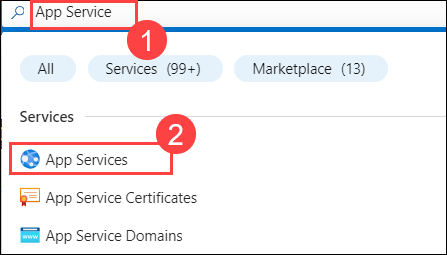
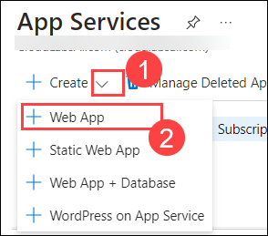
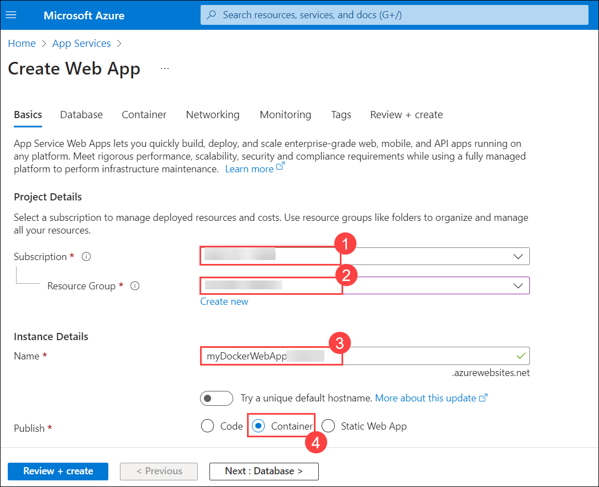
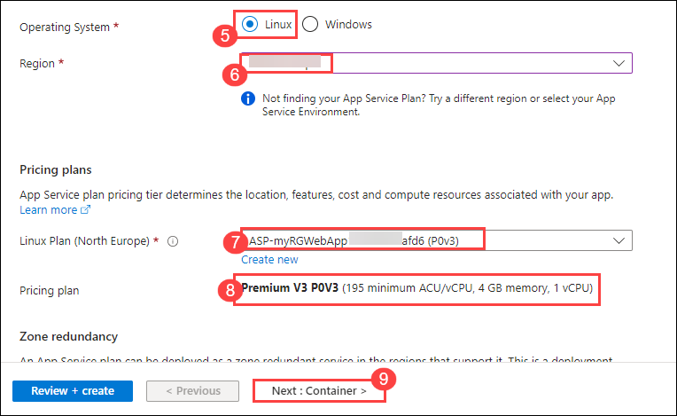
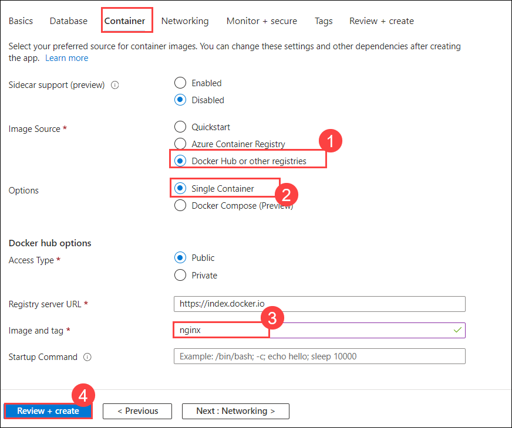
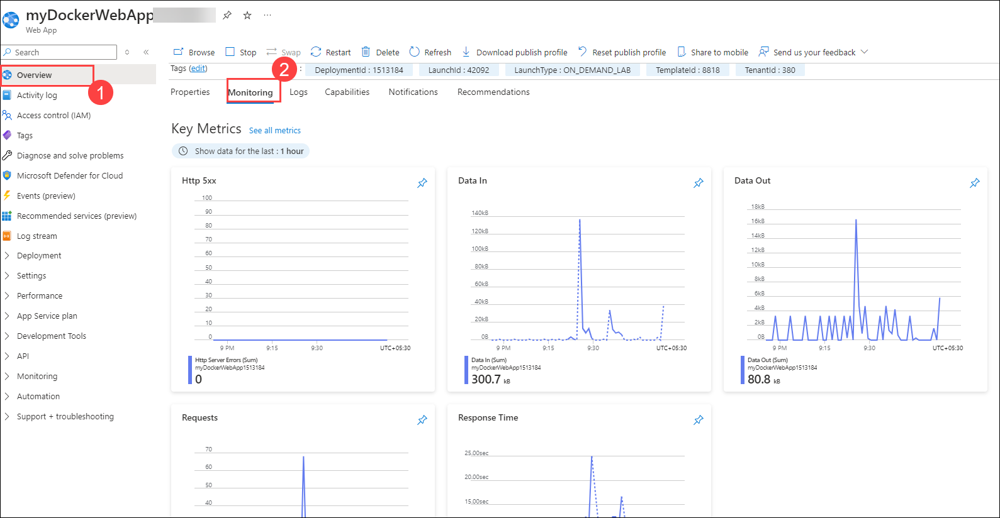

# Lab 02 - Create a Web App

### Estimated Timing: 20 Minutes

## Lab Overview

Azure App Service is a fully managed web application hosting platform. Azure offers this Platform as a Service (PaaS). Azure App Service is actually a collection of four services, all of which are built to help you host and run web applications. The four services (Web Apps, Mobile Apps, API Apps, and Logic Apps) look different, but in the end, they all operate in very similar ways. Web apps are the most commonly used of the four services, and this is the service that we will be using in this lab.

In this walkthrough, we will create a new web app that runs a Docker container. 

## Lab Objectives

In this lab, you will be able to complete the following tasks:
+ **Task 1:** Create a Web App
+ **Task 2:** Test the Web App
  
## Architecture Diagram

 

### Task 1: Create a Web App
In this task, you will create an Azure App Service Web App.

1. On the **Azure Portal** page, in the **Search** **Resources, Services, and Docs** (G+/) box at the top of the portal, enter **App Service (1)**, and then select **App Services (2)** under **Services**.

    

1. On the **App Services** blade, click on the **+ Create (1)** option, and then from the dropdown, select **+ Web App (2)**.

    

1. Within the **Basics** tab from the **Create Web App** blade, specify the following and click on **Next : Database > (9)**.
 
    | Setting | Value |
    | -- | -- |
    | Subscription | **Accept default subscription (1)** |
    | Resource Group | **AZ-900-<inject key="DeploymentID" enableCopy="false"/>** **(2)** |
    | Name | **myDockerWebApp<inject key="DeploymentID" enableCopy="false"/> (3)** |
    | Publish | **Container (4)** |
    | Operating System | **Linux (5)** |
    | Region | **<inject key="Region" enableCopy="false"/>** **(6)** (ignore any service plan availability warnings) |
    | Linux Plan | **Leave as default (7)** |
    | Pricing Plan | **Premium V3 POV3 (8)** |
    |||

    

    

1. On the **Database** tab, leave everything as default, and click on **Next: Container >**.

1. Within the **Container** tab, specify the following to configure the container information. The startup command is optional and not needed in this exercise. Next, click on **Review + create (4)**.

    | Setting | Value |
    | -- | -- |
    | Image Source | **Docker Hub or other registries (1)** |
    | Options | **Single container (2)** |
    | Image and tag | **nginx (3)** |
    |||

    

    >**Note:** This is the same container that was used in the Container Instances walkthrough to display a Hello World message.

1. Once validation is passed, click on **Create**.

### Task 2: Test the Web App

In this task, we will test the web app.

1. Wait for the web app to deploy. Once deployment is successful, click on **Go to resource**.

   

1. On the **Overview** blade, locate  the **Default domain** entry.

     

1. Copy the URL and paste it into a new browser tab to observe the **Welcome to nginx** page.

    

1. Switch back to the **Overview (1)** blade of your web app and select the **Monitoring (2)** tab. Note that it includes several charts. If you repeat **Step 4** a few times, you should be able to see the corresponding telemetry being displayed in the charts. This includes the number of requests and average response time.

    

> **Congratulations** on completing the task! Now, it is time to validate it. Here are the steps:
> - Click on the validate button for the corresponding task. If you receive a success message, you can proceed to the next task. 
> - If not, carefully read the error message and retry the step, following the instructions in the lab guide.
> - If you need any assistance, please contact us at **labs-support@spektrasystems.com**. We are available 24/7 to help.

<validation step="4d77e5af-2938-4f15-8e4f-d313fef1f4a3" />

## Summary

In this exercise, we created a web app and successfully tested its functionality. We explored the process of deploying a web app to the cloud, ensuring that it was set up correctly and performed as expected. Throughout the exercise, we gained practical experience in web app creation and testing, learning how to manage and validate cloud-based web applications.

## Review
In this lab, you have:
- Created a web app.
- Tested the web app.

## Reference Links

- https://azure.microsoft.com/en-us/products/app-service/?ref=jimmybogard.com

- https://learn.microsoft.com/en-us/training/modules/host-a-web-app-with-azure-app-service/

## You have successfully completed this lab. Proceed with the next lab.
