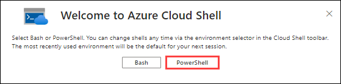

# Lab 03 - Deploy Azure Container Instances

### Estimated Timing: 15 Minutes

## Lab Overview

Azure Container Instances enables exposing your container groups directly to the internet with an IP address and a fully qualified domain name (FQDN). When you create a container instance, you can specify a custom DNS name label so your application is reachable. Azure Container Instances offers the fastest and simplest way to run a container in Azure, without having to manage any virtual machines and without having to adopt a higher-level service.

In this walkthrough, we create, configure, and deploy a Docker container by using Azure Container Instances (ACI) in the Azure Portal. The container is a Welcome to ACI web application that displays a static HTML page.

## Lab Objectives

In this lab, you will be able to complete the following tasks:
+ **Task 1:** Create a Container Instance
+ **Task 2:** Verify deployment of the Container Instance

## Architecture Diagram

 

### Task 1: Create a Container Instance

In this task, we will create a new Container Instance for the web application.

1. Open **Azure Cloud Shell** on **Azure Portal** by clicking on the icon (as shown in the screenshot) in the top right of the same.

    

1. You might be prompted to choose the type of shell you want to use (*Bash* or *PowerShell*) if you open the **Cloud Shell** for the first time. If so, select **PowerShell**.

    
   
1. On the **Getting Started** page, click on the **No storage account required (1)** option and select your **Subscription (2)** - **Storage Account Subscription**. Now, click on **Apply (3)**.

    

1. In the upper-left menu of the Cloud Shell pane, make sure you are using **PowerShell**. If not selected, select **Switch to PowerShell**. In the **Switch to PowerShell in Cloud Shell** pop-up, select **Confirm**.

1. In the PowerShell session, within the Cloud Shell pane, run the following command. 

    ```cli
    az container create --resource-group AZ-900-<YourDeploymentID> --name mycontainer --image mcr.microsoft.com/azuredocs/aci-helloworld --cpu 1 --memory 1.5 --dns-name-label mycontainerdns<YourDeploymentID> --ports 80
    ```

    >**Note:** Replace < YourDeploymentID> with the Deployment ID provided in the Lab VM's **Environment** tab.

1. While you wait, you may be interested in viewing the [sample code behind this simple application](https://github.com/Azure-Samples/aci-helloworld). Browse the \app folder.

1. You will be able to see the resource created in the **PowerShell** window.

    

### Task 2: Verify Deployment of the Container Instance

In this task, we will verify that the Container Instance is running. We will ensure this by checking if the welcome page is displayed.

1. After the deployment is complete, navigate to the **AZ-900<inject key="DeploymentID" enableCopy="false" />** resource group and select the **mycontainer** Container Instance.

   

1. On the **Overview** blade of **mycontainer**, ensure your container **Status** is **Running**.

    

1. Locate and copy the **fully qualified domain name (FQDN)**.

    

1. Paste the container's FQDN into the new browser tab and press **Enter**. The welcome page should be displayed.

   >**Note**: It might take 3 - 5 minutes to load the page.
 
   
	
   >**Note**: You could also use the container IP address in your browser.
   
> **Congratulations** on completing the task! Now, it is time to validate it. Here are the steps:
> - Click on the **Validate** button for the corresponding task. If you receive a success message, you can proceed to the next task. 
> - If not, carefully read the error message and retry the step, following the instructions in the lab guide.
> - If you need any assistance, please contact us at **labs-support@spektrasystems.com**. We are available 24/7 to help.

<validation step="3b652738-7603-45ae-97c0-83e81a66c66e" />

## Summary
In this exercise, we created a container instance and verified its successful deployment. We explored the process of provisioning a container in the cloud, ensuring that it was deployed correctly and functioned as intended. Throughout the exercise, we gained valuable experience in managing containerized applications and validating their deployment in a cloud environment.

## Review
In this lab, you have:
- Created a Container Instance.
- Verified deployment of the Container Instance.

## Reference Links

- https://learn.microsoft.com/en-us/azure/container-instances/container-instances-overview

- https://learn.microsoft.com/en-us/azure/container-instances/container-instances-quickstart-portal
  
## You have successfully completed this lab. Proceed with the next lab.

