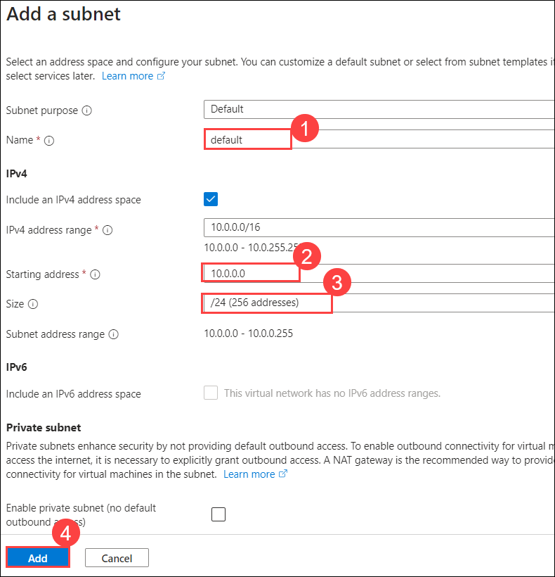

# Lab 04 - Create a Virtual network

## Lab overview

Azure Virtual Network (VNet) is a service offered by Microsoft Azure that allows you to create private, isolated networks in the Azure cloud. It enables you to securely connect Azure resources, such as virtual machines (VMs), to each other, to on-premises networks, and to the internet.

In this walkthrough, we will create a virtual network, deploy two virtual machines onto that virtual network and then configure them to allow one virtual machine to ping the other within that virtual network.

## Lab objectives

In this lab, you will complete the following tasks:

+ Task 1: Create a virtual network
+ Task 2: Create two virtual machines
+ Task 3: Test the connection

## Estimated timing: 20 minutes

## Architecture diagram

 

### Task 1: Create a virtual network

In this task, we will create a virtual network. 

1. On Azure Portal page, in **Search resources, services, and docs (G+/)** box at the top of the portal, enter **Virtual networks (1)**, and then select **Virtual networks (2)** under services.

   
   
1. On **Virtual networks** page, click **+ Create**. 

1. On the **Create virtual network** blade, fill in the following (leave the defaults for everything else):

      | Setting | Value | 
      | ---     | ---   |
      | Subscription | **Keep default subscription (1)**  |
      | Resource group |  **AZ-900-<inject key="DeploymentID" enableCopy="false"/> (2)** |
      | Name    | **vnet1 (3)** |
      | Location | **(US) East US (4)** |

      
   
1. On the **Create virtual network** blade, click **Next** twice to go to the IP Addresses tab and delete precreated IP address and click on **Add IPV4 address** to create a new address space.

    | Setting | Value | 
    | --- | --- |
    | Address space |**10.1.0.0/16**|
 
 1. Click on **+ Add a subnet** and ensure if the following address is reflecting (Delete if any subnet exists already with the name default) if you have made any changed then click on **Add (4)**.
  
    | Setting | Value | 
    | --- | --- |
    | Name |**default (1)**|
    | Starting address | **10.1.0.0 (2)**|
    | Size | **/24 (3)**
  
    

    >**Note:** If you want to learn more about IPV4 address go through the following link:[IPV4](https://www.internold.com/lesson/fundamentals-of-ipv4-addressing-and-routing-detailed/)

1. Click the **Review + create** button. Ensure the validation passes.

   

1. Click the **Create** button to deploy the virtual network. 
    
### Task 2: Create two virtual machines

In this task, we will create two virtual machines in the virtual network. 

1. On Azure Portal page, in Search resources, services, and docs (G+/) box at the top of the portal, enter **Virtual machines (1)**, and then select **Virtual machines (2)** under services.

    

1. On the **Virtual machines** blade, click **+ Create (1)** and choose **Azure virtual machine (2)**.

     

1. On the **Basics** tab, fill in the following information (leave the defaults for everything else) then click on **Next: Disks (11)**

   | Setting | Value | 
   | --- | --- |
   | Subscription | **Use default supplied (1)**  |
   | Resource group |  **AZ-900-<inject key="DeploymentID" enableCopy="false"/> (2)** |
   | Virtual machine name | **vm1 (3)**|
   | Region | **(US) East US (4)** |
   | Image | **Windows Server 2019 Datacenter - x64 Gen2 (5)** |
   | Username| **azureuser (6)** |
   | Password| **Pa$$w0rd1234 (7)** |
   | Confirm password| **Pa$$w0rd1234 (8)** |   
   | Public inbound ports| Select **Allow selected ports (9)**  |
   | Selected inbound ports| **RDP (3389) (10)** |

       

          

1. Click **Next : Disks >** to switch to the **Disks** tab and in the **OS Disk type** select **Standard HDD** from the dropdown and leave everything else as default and click **Next : Networking >**. 

    

1. In **Networking** tab, make sure the virtual machine is placed in the **vnet1** virtual network. Review the default settings, but do not make any other changes. 

   | Setting | Value | 
   | --- | --- |
   | Virtual network | **vnet1** |

   
    
1. Click **Review + create**. After the Validation passes, click **Create**. Deployment times can vary but it can generally take between three to six minutes to deploy.

1. Monitor your deployment, but continue on to the next step. 

1. Create a second virtual machine by repeating steps **1 to 5** above from the task 2. Make sure you use a different virtual machine name as given below, and also the virtual machine is within the same virtual network, and is using a new public IP address: 

    | Setting | Value |
    | --- | --- |
    | Resource group | **AZ-900-<inject key="DeploymentID" enableCopy="false"/>** |
    | Virtual machine name |  **vm2** |
    | Virtual network | **vnet1** |
    | Public IP | (new) **vm2-ip** |

1. Wait for both virtual machines to deploy. 

### Task 3: Test the connection 

In this task, we will try to test whether the virtual machines can communicate (ping) each other. 

1. Naviage to three horizontal line from the top left cornner **(1)**, then select **All resources (2)**.

     

1. On the **All resources** blade, search for **vm1** and select it.

     


 1. Open its **Overview** blade, and make sure its **Status** is **Running**. You may need to **Refresh** the page.    

1. On the virtual machine **Overview** blade, click the **Connect (1)** drop-down and choose the **Connect (2)** from the dropdown.

     
   
    >**Note**: The following directions tell you how to connect to your VM from a Windows computer. On a Mac, you need an RDP client such as this Remote Desktop Client from the Mac App Store and on a Linux computer you can use an open source RDP client.

1. Within the **Connect** page, click on **Download RDP File**.

   

1. Once the file is downloaded,you will be directed with a warning, click on **Keep**.

1. Open the downloaded RDP file and click **Connect** when prompted. 

    

1. In the **Windows Security** window, select **More choices (1)** and then choose **Use a different account (2)**. Provide the username as `azureuser` **(3)** and the password `Pa$$w0rd1234` **(4)**. Then click **OK (5)** to connect.

    

1. You may receive a certificate warning during the sign-in process. Click **Yes** or to create the connection and connect to your deployed VM. You should connect successfully. Close the Windows Server and Dashboard windows that pop up. You should see a Blue Windows background. You are now in your virtual machine.

    

   >**Note:** Repeat step 1 to 6 for **vm2**.

1. In *both* newly created virtual machines(`vm1,vm2`), connect via RDP and **disable both the public and private firewall**. Follow the steps below to complete the task.

   - Click on **Start menu (1)** then select **Settings (2)**.   

        
   
   - Select **Network & Internet**.

         

   - Navigate to **Windows Firewall**.   

      

   - Then **disable both the public and private firewall**.

        

1. Open up a PowerShell command prompt on the Virtual machine(**vm1**), by clicking the **Start** button, type **PowerShell (1)**, right click on **Windows PowerShell (2)** then select **Run as administrator (3)**

    

1. Try to ping vm2 (make sure vm2 is running). 
    ```
    ping vm2
    ```
1. You should be successful. You have pinged VM2 from VM1.
    
     

<validation step="528acab3-c436-42e6-bb0b-172c0237f879" />

> **Congratulations** on completing the task! Now, it's time to validate it. Here are the steps:
> - If you receive a success message, you can proceed to the next task.
> - If not, carefully read the error message and retry the step, following the instructions in the lab guide. 
> - If you need any assistance, please contact us at labs-support@spektrasystems.com. We are available 24/7 to help you out.

### Review
In this lab, you have completed:
- Created a virtual network
- Created two virtual machines
- Tested the connection

### Reference Links

- https://learn.microsoft.com/en-us/azure/virtual-network/virtual-networks-overview
- https://learn.microsoft.com/en-us/azure/virtual-network/
- https://learn.microsoft.com/en-us/azure/virtual-network/virtual-network-peering-overview
 
## You have successfully completed this lab. Proceed with the next lab.
