# Lab 05 - Create blob storage

## Lab overview

Storage account is a resource that acts as a container that groups all the data services from Azure storage (Azure blobs, Azure files, Azure Queues, and Azure Tables). This helps us manage all of them as a group.

In this walkthrough, we will create a storage account, then work with blob storage files.

## Lab objectives

In this lab, you will complete the following tasks:

+ Task 1: Create a storage account
+ Task 2: Work with blob storage
+ Task 3: Monitor the storage account

## Estimated timing: 15 minutes

## Architecture diagram

 

### Prerequisites

1. In the **Lab-VM**, search for **Notepad (1)** in the Start menu then launch **Notepad (2)**. Then input a random text within the Notepad application.

   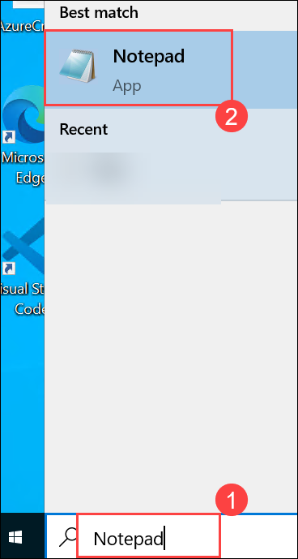 

1. Next, access the menu bar at the top and select **File (1)> Save as (2)**.

   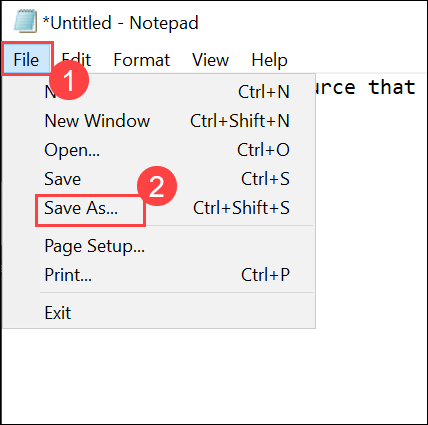 

1. Navigate to the **Desktop (1)** directory, name the file as **Test (2)** and **Save (3)** the file to the desktop.

   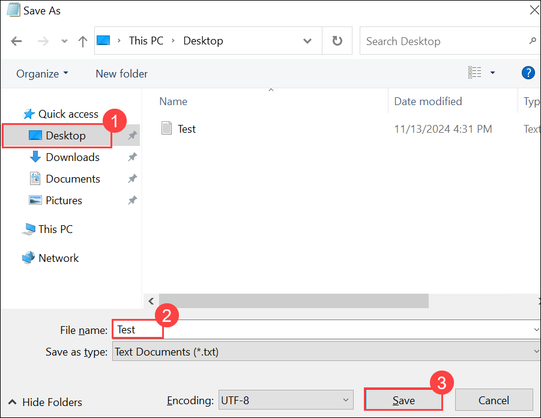 

### Task 1: Create a storage account

In this task, we will create a new storage account. 

1. On the Azure portal, from the **Azure services** blade, search for **Storage accounts (1)** and select **Storage accounts (2)**.

   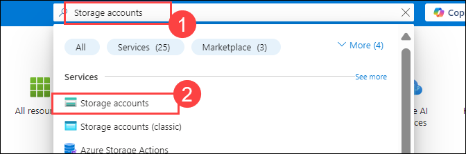 

1. Click **+ Create**. 

   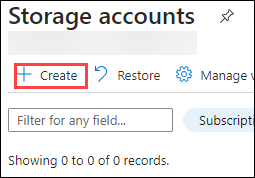 

1. On the **Basics** tab of the **Create storage account** blade, fill in the following information.Leave the defaults for everything else, then click on **Next (7)**.

    | Setting | Value | 
    | --- | --- |
    | Subscription | **Choose the default subscription (1)** |
    | Resource group | **AZ-900-<inject key="DeploymentID" enableCopy="false"/> (2)** |
    | Storage account name | **storageaccount<inject key="DeploymentID" enableCopy="false" /> (3)** |
    | Region | **<inject key="Region" enableCopy="false"/> (4)**  |
    | Performance | **Standard (5)** |
    | Redundancy | **Locally redundant storage (LRS)(6)** |
    
      

1. On the **Advanced (7)** tab of the **Create a storage account**, choose **Hot (1)** for **Access tier** setting under **Blob storage** then click on **Review + create (2)**.

   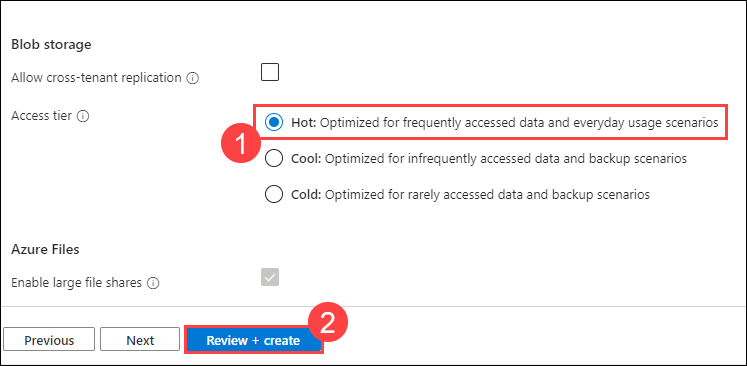 

1. Once validated, click **Create**. Wait for the **Deployment Succeeded** notification.

   

1. From the Home page, search for and select **Storage accounts** and ensure your new storage account is listed.

    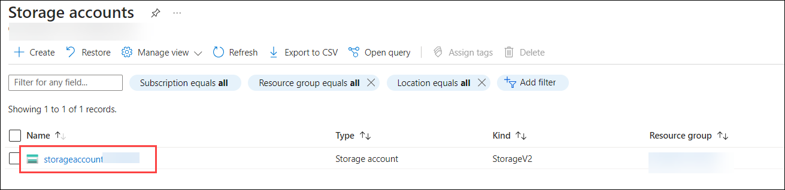

### Task 2: Work with blob storage

In this task, we will create a Blob container and upload a blob file. 

1. Click on the **storageaccount<inject key="DeploymentID" enableCopy="false" />** (newly created storage account).

    

1. From the left navigation pane under **Data storage** section, click **Containers (1)**. Click **+ Container (2)** and complete the information. Use the Information icons to learn more. When done click **Create (5)**.

   | Setting | Value |
   | ---- | ---- |
   | Name | **container1 (3)**|
   | Anonymous access level| **Private (no anonymous access) (4)** |

   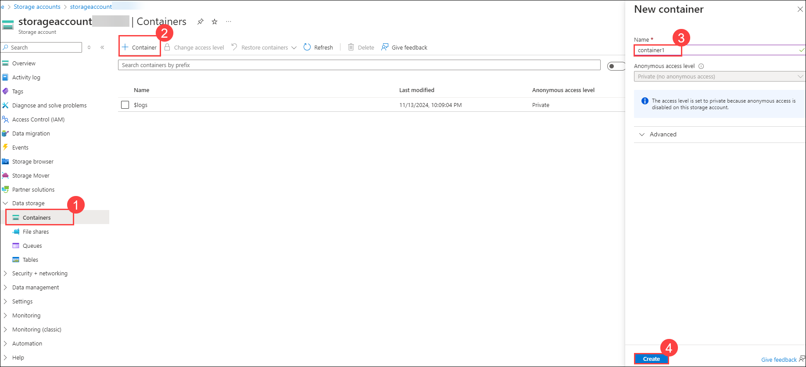    
  
1. Click the **container1** container.

   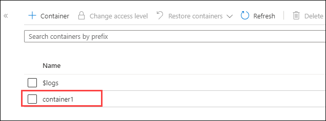 

1. Click on **Upload**.

   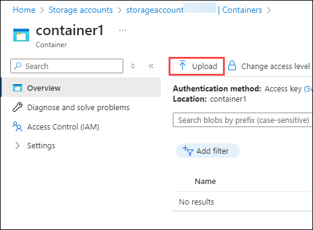 

1. Click on **Browse to a file (1)** then select **Test.txt (3)** that you created in a previous task, located on the **desktop (2)**. Then select the file and click **Open (4)**.

   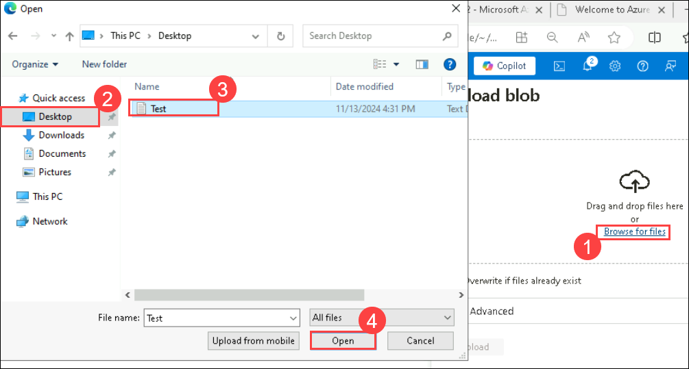 
  
1. Click the **Advanced** arrow, leave the default values but review the available options, and then click **Upload**.

   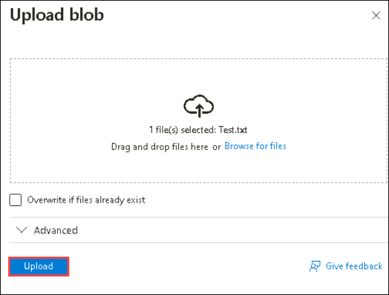 

    >**Note:** You can upload as many blobs as you like in this way. New blobs will be listed within the container.

1. Once the file is uploaded, right-click on the file and notice the options including **View/edit, Download, Properties, and Delete**. 

   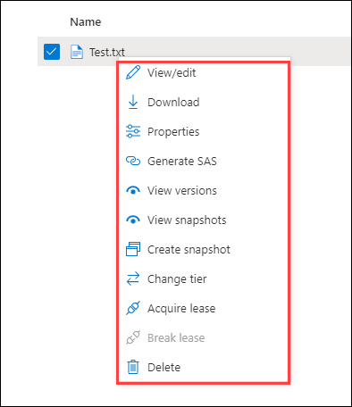 

   >**Note:** In the event that the access level for the storage account is configured as public, accessing the contents of the storage account can be done through a URL. To gain a deeper understanding of Storage Account access levels, please go through the following link:[Access Levels](https://learn.microsoft.com/en-us/azure/storage/blobs/anonymous-read-access-configure?tabs=portal)

1. As you have time, from the storage accounts blade, review the options for **Files, Tables, and Queues**.

   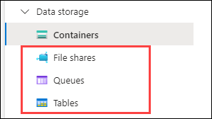 

### Task 3: Monitor the storage account

1. If needed, return to the **storageaccount<inject key="DeploymentID" enableCopy="false" />** blade and from the left-navigation menu, click on the **Diagnose and solve problems**. 

   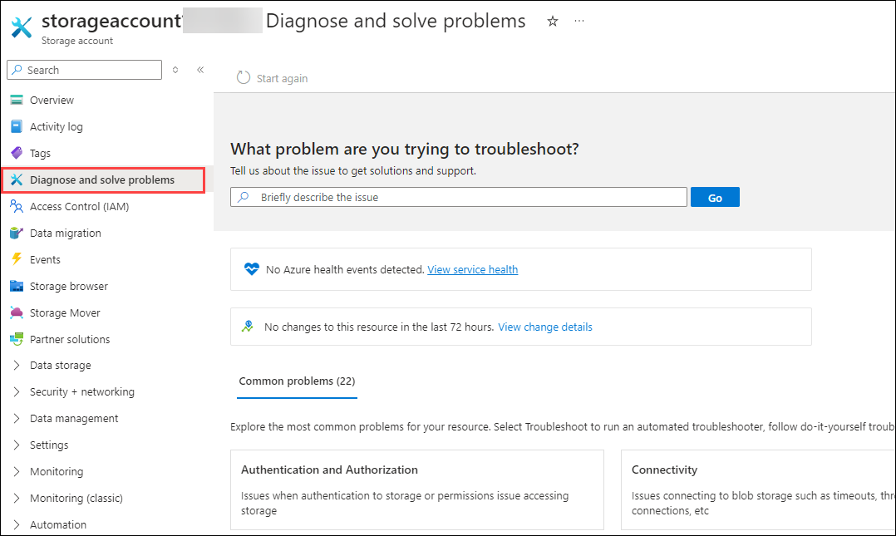 

1. Explore some of the most common storage problems. Notice there are multiple troubleshooter.

1. On the storage account blade, from the left navigation menu, scroll down to the **Monitoring (1)** section and click **Insights (2)**. Notice there is information on *Failures, Performance, Availability, and Capacity*.

    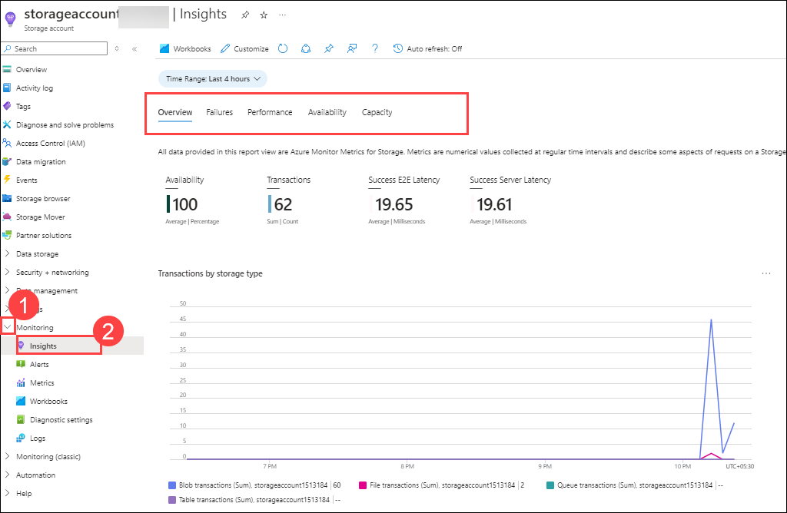

    >**Note:** In your Lab-Vm information will be different.

<validation step="8f85ae2c-c70e-4d55-9443-7e1b7e19a6cf" />

> **Congratulations** on completing the task! Now, it's time to validate it. Here are the steps:
> - If you receive a success message, you can proceed to the next task.
> - If not, carefully read the error message and retry the step, following the instructions in the lab guide. 
> - If you need any assistance, please contact us at labs-support@spektrasystems.com. We are available 24/7 to help you out.

### Review
In this lab, you have completed:
- Created a storage account
- Worked with blob storage
- Monitored the storage account

## Reference link

- https://learn.microsoft.com/en-us/azure/storage/blobs/quickstart-storage-explorer

## You have successfully completed this lab.
