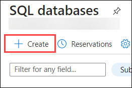
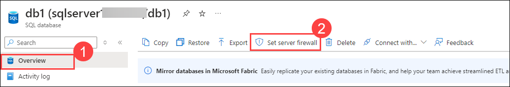

# Lab 06 - Create a SQL database

## Lab overview

A SQL database is a collection of tables that stores a specific set of structured data using a relational model. It is designed to efficiently organize and retrieve data using a language called Structured Query Language (SQL).

In this walkthrough, we will create a SQL database in Azure and then query the data in that database.

## Lab objectives

In this lab, you will complete the following tasks:

+ Task 1: Create the database
+ Task 2: Test the database

## Estimated timing: 20 minutes

## Architecture diagram

 

### Task 1: Create the database

In this task, we will create a SQL database based on the AdventureWorksLT sample database. 

1. On the Azure portal, from the **Search resources, services, and docs** blade, search for **SQL databases (1)** and select **SQL databases (2)**. 

   

1. Click **+ Create**. 

   
   
1. On the **Basics** tab, fill in this information and then click on **Next: Networking> (7)**.  

    | Setting | Value | 
    | --- | --- |
    | Subscription | **Choose your subscription (1)** |
    | Resource group | **AZ-900-<inject key="DeploymentID" enableCopy="false"/> (2)** |
    | Database name| **db1 (3)** |
    | Workload Environment| **Development (5)** |
    | Compute + storage| **General Purpose - Serverless Gen 5 (6)** |

    
    
1. Next to the **Server** drop down list, click **Create new**. Click **OK (7)** when finished. **(4)**       

    | Setting | Value | 
    | --- | --- |
    | Server name | **sqlserver<inject key="DeploymentID" enableCopy="false"/> (1)** (must be unique) |
    | Location | **(US) East US (2)** |
    | Authentication method | **Use SQL authentication (3)** | 
    | Server admin login | **sqluser (4)** |
    | Password | **Pa$$w0rd1234 (5)** |
    | Confirm Password | **Pa$$w0rd1234 (6)** |

        

1. On the **Networking** tab and configure the following settings (leave others with their defaults) and then click on **Next: Security> (4)**

    | Setting | Value | 
    | --- | --- |
    | Connectivity method | **Public endpoint (1)** |    
    | Allow Azure services and resources to access this server | **Yes (2)** |
    | Add current client IP address | **No (3)** |

            

1. On the **Security** tab. Verfy the below Setting and then click on **Next: Additional settings >**
 
    | Setting | Value | 
    | --- | --- |
    | Enable Microsoft Defender for SQL| **Not now** |

1. On the **Additional settings** tab, provide the below information. We will be using the **AdventureWorksLT** sample database, if pop-up comes, click on **OK (2)** and then click on **Review + create (3)**.

    | Setting | Value | 
    | --- | --- |
    | Use existing data | **Sample (1)** |

            

1. Review the configurations and then click **Create** to deploy and provision the resource group, server, and database. Deployment may take approximately 2 to 5 minutes.

   

1. Wait for the deployment to get succeeded.

### Task 2: Test the database

In this task, we will configure the SQL server and run a SQL query. 

1. From the **Search resources, services, and docs** blade, search and select **SQL databases** and ensure your new database was created. You may need to **Refresh** the page.

    

1. Click the **db1** entry representing the SQL database you created, and then click **Query editor (preview)** from the left navigation pane.

   

1. Login as **sqluser (1)** with the password `Pa$$w0rd1234` **(2)** and then click on **OK (3)**.

   

1. If you are able to login proceed with **Step 7**.

1. If you are not able to login, follow the below steps: 

    
    
    - From the **db1** blade, click on **Overview (1)** and then select **Set server firewall (2)** from the top menu bar.

          

    - Scroll down to the Firewall rules section and click on **+ Add your client IPv4 address (1)**. Be sure to **Save (2)** your changes. 

      

1. Return to your SQL database and the **Query Editor (Preview)** login page. Try to login again as `sqluser` with the password `Pa$$w0rd1234`. Click on **OK**. This time you should succeed. Note that it may take a couple of minutes for the new firewall rule to be deployed. 

1. Once you log in successfully the query pane appears, enter the following query into the editor pane **(1)** and then click **Run (2)**.

    ```
    SELECT TOP 20 pc.Name as CategoryName, p.name as ProductName
    FROM SalesLT.ProductCategory pc
    JOIN SalesLT.Product p
    ON pc.productcategoryid = p.productcategoryid;
    ```

       

    >**Note**: This SQL query selects the top 20 records from the SalesLT.ProductCategory table and SalesLT.Product table, displaying the CategoryName from the ProductCategory table as "CategoryName" and the ProductName from the Product table as "ProductName." The query performs an inner join between the two tables based on the productcategoryid column

1. Review the query results in the **Results** pane. The query should run successfully.

    

1. Close the query editor, and select **OK** on the **portal.azure.com** says.

> **Congratulations** on completing the task! Now, it's time to validate it. Here are the steps:
> - If you receive a success message, you can proceed to the next task.
> - If not, carefully read the error message and retry the step, following the instructions in the lab guide. 
> - If you need any assistance, please contact us at labs-support@spektrasystems.com. We are available 24/7 to help you out.

<validation step="3f6d725f-f26f-461d-a922-9f871108d2f1" />

## Summary
In this exercise, we created a database and tested its functionality to ensure it was set up correctly. We explored the process of database creation, followed by verifying its performance and accessibility. Throughout the exercise, we gained hands-on experience in setting up and testing databases in the cloud environment.

### Review
In this lab, you have completed:
- Created the database
- Tested the database

## Reference link

- https://learn.microsoft.com/en-us/sql/relational-databases/databases/create-a-database?view=sql-server-ver16
  
## You have successfully completed this lab. Proceed with the next lab.
