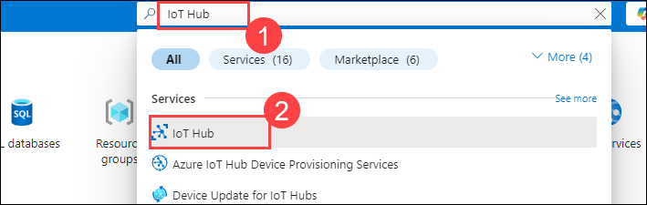
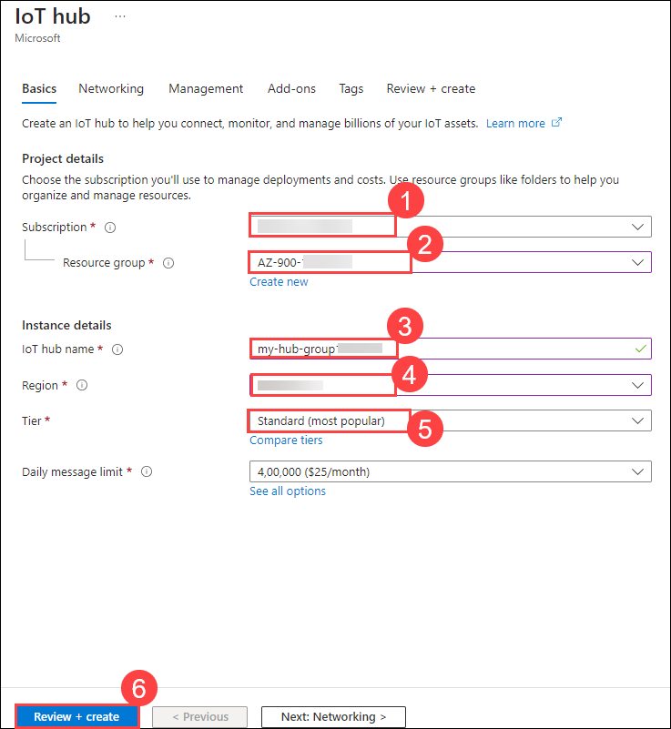
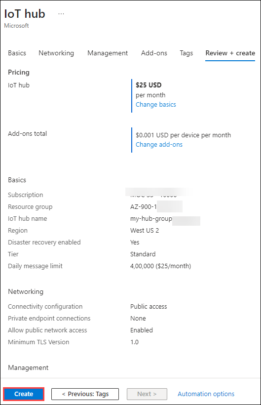
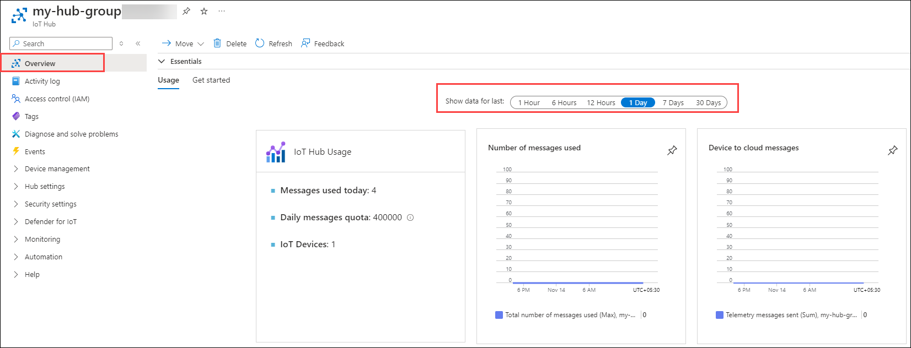

# Lab 07 - Implement an Azure IoT Hub

### Estimated Timing: 20 Minutes

## Lab Overview

The Internet of Things (IoT) is a network of physical devices that connect to and exchange data with other devices and services over the Internet or other networks. Azure IoT Hub is a managed service hosted in the cloud that acts as a central message hub for communication between an IoT application and its attached devices.

Azure IoT Edge is a device-focused runtime that enables you to deploy, run, and monitor containerized Linux workloads.

Azure IoT Edge is made up of three components:

 - IoT Edge modules are containers that run Azure services, third-party services, or your own code. Modules are deployed to IoT Edge devices and execute locally on those devices.
 
 - The IoT Edge runtime runs on each IoT Edge device and manages the modules deployed to each device.

 - A cloud-based interface enables you to remotely monitor and manage IoT Edge devices.

In this walkthrough, we will configure a new Azure IoT Hub in the Azure portal and then authenticate a connection to an IoT device using the online Raspberry Pi device simulator. Sensor data and messages are passed from the Raspberry Pi Simulator to your Azure IoT Hub, and you will be able to view relevant metrics related to the messaging activity in the Azure portal.

## Lab Objectives

In this lab, you will be able to complete the following tasks:

+ **Task 1:** Create an IoT Hub
+ **Task 2:** Add an IoT Device
+ **Task 3:** Test the Device using the Raspberry Pi Simulator

## Architecture Diagram

 

### Task 1: Create an IoT Hub

In this task, we will create an IoT Hub. 

1. On the **Azure portal** page, in the **Search Resources, Services and Docs (G+/)** box at the top, enter **IoT Hub (1)** and then select **IoT Hub (2)** under services.

   
  
1. On the **IoT Hub** blade, click on **+ Create**.

1. On the **Basics** tab of the **IoT Hub** blade, fill in the fields with the following details and click on **Review + create (6)**.

    | Settings | Values |
    |--|--|
    | Subscription | **Accept default subscription (1)** |
    | Resource Group | **AZ-900-<inject key="DeploymentID" enableCopy="false"/> (2)**  |
    | IoT Hub Name | **my-hub-group<inject key="DeploymentID" enableCopy="false" /> (3)** |
    | Region | **<inject key="Region" enableCopy="false"/> (4)** |
    | Tier | **Standard (most popular) (5)** |
    |||

    
  
1. Click on the **Create** button on the **Review + create** tab to begin creating your new Azure IoT Hub instance.

   

1. Wait until the Azure IoT Hub instance is deployed. 

### Task 2: Add an IoT Device

In this task, we will add an IoT device to the IoT Hub. 

1. When the deployment has been completed, click on the **Go to resource** option from the deployment blade. 

	

1. To add a new IoT device, scroll down to the **Device management** section, then select **Devices (1)**. Finally, click on **+ Add Device (2)**.

	

   >**Note:** If you are not able to see the left navigation pane, please try zooming out/in in the browser settings inside the lab VM.

1. Provide a **Device ID (1)** for your new IoT device, **<inject key="DeploymentID" enableCopy="false" />** and click on the **Save (2)** button. This will create a new IoT device identity in your Azure IoT Hub.

   
  
1. If you do not see your new device, **refresh** the IoT devices page.

   

1. Select **<inject key="DeploymentID" enableCopy="false" />** and copy the **Primary Connection String** value, then paste it into any text editor like Notepad. You will use this key in the next task to authenticate a connection to the Raspberry Pi simulator.

	

### Task 3: Test the Device using the Raspberry Pi Simulator

In this task, we will test our device using the Raspberry Pi Simulator. 

1. Open a new tab in the web browser and browse the [online Raspberry Pi Simulator](https://azure-samples.github.io/raspberry-pi-web-simulator/#Getstarted). 

1. Read about the Raspberry Pi Simulator. If there is an overview pop-up, select "**X**" to close the window.

    

1. In the code area, on the right side, locate the line with 'const connectionString =.' Replace **[Your IoT Hub device connection string]**  with the connection string you copied from the **Azure portal**. Note that the connection string includes the **Device ID** and **Shared Access Key** entries.

	

1. Click **Run** (below the code area) to run the application.

    
  
1. The console output should show the sensor data and messages that are sent from the Raspberry Pi Simulator to your Azure IoT Hub. Data and messages are sent each time the Raspberry Pi Simulator LED flashes. 

	

1. Click on **Stop** to stop sending data.

1. Return to the Azure portal and your IoT Hub.

1. Switch to the IoT Hub **Overview** blade and scroll down to the **IoT Hub Usage** information. Notice the chart, and you can select **Show data for last** to see the data based on days.

   

> **Congratulations** on completing the task! Now, it is time to validate it. Here are the steps:
> - Click on the **Validate** button for the corresponding task. If you receive a success message, you can proceed to the next task. 
> - If not, carefully read the error message and retry the step, following the instructions in the lab guide.
> - If you need any assistance, please contact us at **labs-support@spektrasystems.com**. We are available 24/7 to help.

<validation step="c3f78c30-0c67-4b92-b8e7-9cf3c9df79a7" />

## Summary
In this exercise, we created an IoT Hub and added an IoT device to it. We then tested the device using the Raspberry Pi Simulator to ensure it was functioning correctly. Throughout the exercise, we gained practical experience in setting up an IoT Hub, registering devices, and simulating device interactions in an IoT environment.

## Review
In this lab, you have:
- Created an IoT Hub.
- Added an IoT device.
- Tested the device using the Raspberry Pi Simulator.

## Reference Links

- https://learn.microsoft.com/en-us/azure/iot-hub/iot-concepts-and-iot-hub
  
- https://learn.microsoft.com/en-us/azure/iot-edge/about-iot-edge?view=iotedge-1.4

  
## You have successfully completed this lab. Proceed to the next lab.
