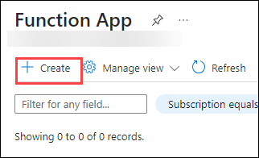
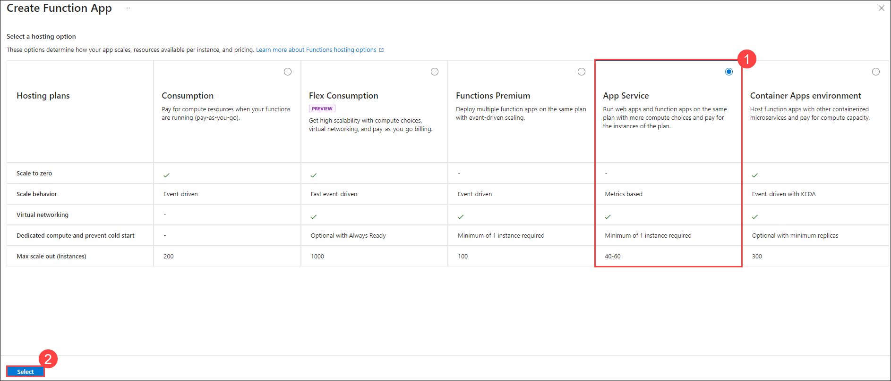
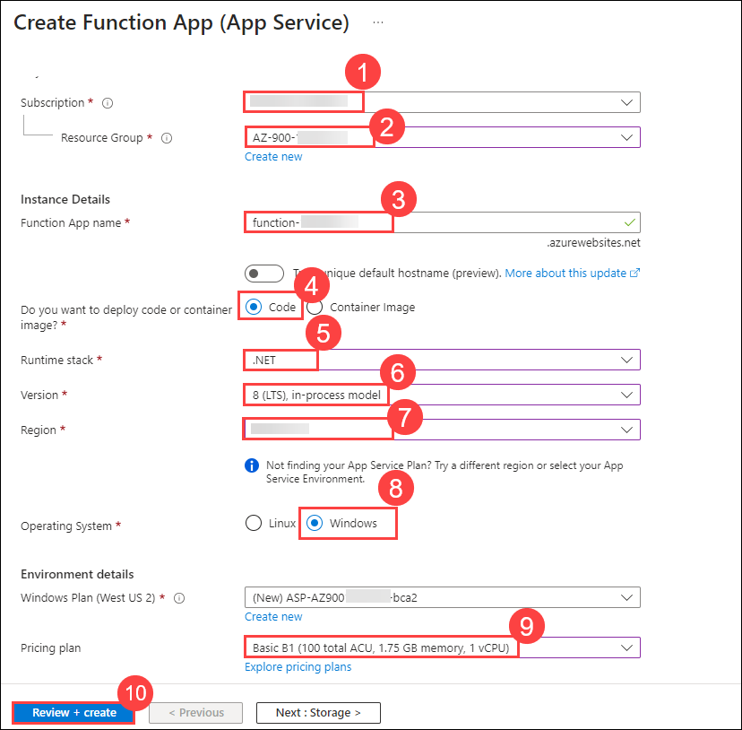
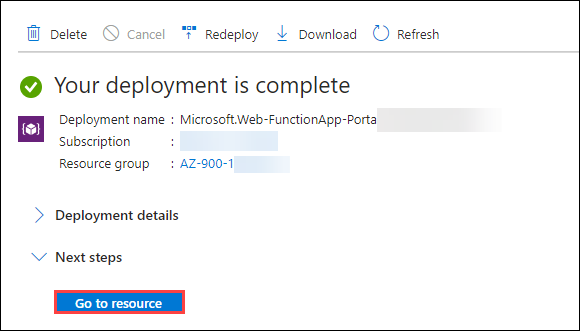
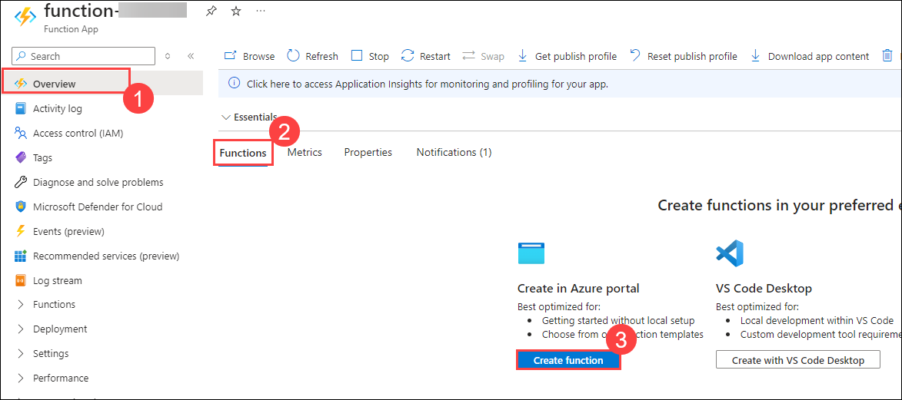
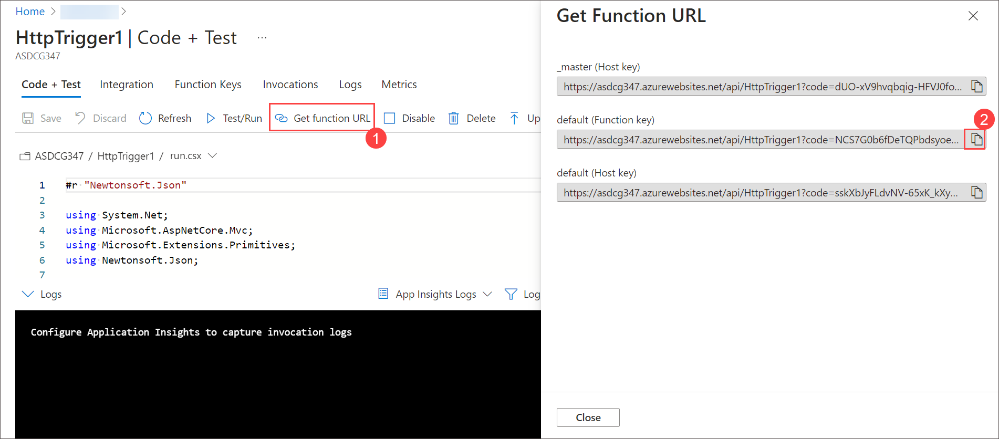

# Lab 08 - Implement Azure Functions

### Estimated Timing: 15 Minutes

## Lab Overview

Azure Functions is a serverless solution that allows you to write less code, maintain less infrastructure, and save on costs. Instead of worrying about deploying and maintaining servers, the cloud infrastructure provides all the up-to-date resources needed to keep your applications running.

In this walkthrough, we will create a Function App to display a 'hello' message when there is an HTTP request.

## Lab Objectives

In this lab, you will be able to complete the following tasks:

+ **Task 1:** Create a Function App
+ **Task 2:** Create an HTTP-Triggered Function and Test

## Architecture Diagram

 

### Task 1: Create a Function App

In this task, we will create a Function App.

1. On the **Azure portal** page, in the **Search Resources, Services, and Docs (G+/)** box at the top, enter **Function App (1)** and then select **Function App (2)** under services.

    
      
1. On the **Function App** blade, click on **+ Create**. 

    

1. Choose the hosting plan as **App Service (1)**, then click on **Select (2)**.

    

1. On the **Basic** tab of the **Function App** blade, specify the following settings and leave all others with their default values, then click on **Review + create (10)**.

    | Settings | Values |
    | -- | --|
    | Subscription | select existing Azure subscription **(1)** |
    | Resource group | select **AZ-900-<inject key="DeploymentID" enableCopy="false"/> (2)** |
    | Function App name | **function-<inject key="DeploymentID" enableCopy="false"/> (3)**|
    | Do you want to deploy code or container image? | **Code (4)**|
    | Runtime stack | **.NET (5)** |
    | Version | **8 (LTS), in-process model (6)** |
    | Region | **<inject key="Region" enableCopy="false"/> (7)**|
    | Operating System  | **Windows (8)**|
    | Pricing plan | Select **Basic B1 (9)** | 

        
        
1. After a successful validation, click on **Create** to begin provisioning and deploying your new Azure Function App.

1. Wait for the notification that the resource has been created. Select **Go to resource**.

    

1. On the **function-<inject key="DeploymentID" enableCopy="false"/>** blade, verify that the Function App has the **Running** status. 

    

# Task 2: Create an HTTP-Triggered Function and Test

In this task, we will use the Webhook + API function to display a message when there is an HTTP request. 

1. On the **Overview (1)** blade, in the **Functions (2)** section, click on **Create function (3)**.

    

1. On the **Select a template** tab of the **Create function** blade, click on the **HTTP trigger (1)** option and then click on **Next (2).**  

    

1. On the **Template details** tab, accept default values and click on **Create**.

   

1. On the **HttpTrigger1 \| Code + Test** blade, review the auto-generated code and note that the code is designed to run an HTTP request and log information. Also, notice the function returns a Hello message with a name. 

1. Click on the **Get function URL (1)** from the top section of the function editor and ensure to copy the value in the **default (Function key) (2)** URL. 

   
   
1. Open a new browser tab and paste the copied function URL into your web browser's address bar. When the page is requested, the function will run. Notice the returned message stating that the function requires a name in the request body.

    
   
1. Append **&name=yourname** to the end of the URL, then click on *Enter*.

    **Note**: Replace ***yourname*** with your first name. For example, if your name is *Cindy*, the final URL will resemble the following. `https://azfuncxxx.azurewebsites.net/api/HttpTrigger1?code=X9xx9999xXXXXX9x9xxxXX&name=Cindy`

     
   
> **Congratulations** on completing the task! Now, it is time to validate it. Here are the steps:
> - Click on the **Validate** button for the corresponding task. If you receive a success message, you can proceed to the next task. 
> - If not, carefully read the error message and retry the step, following the instructions in the lab guide.
> - If you need any assistance, please contact us at **labs-support@spektrasystems.com.** We are available 24/7 to help.

<validation step="cd925c8a-afaf-4fdc-8ce1-8557195ba7e5" />

## Summary
In this exercise, we created a Function App and developed an HTTP-triggered function. We then tested the function to ensure it was triggered correctly and performed as expected. Throughout the exercise, we gained hands-on experience in setting up serverless applications and testing HTTP-triggered functions in a cloud environment.

## Review
In this lab, you have:
- Created a Function App.
- Created an HTTP-triggered function and test.

## Reference Link

- https://learn.microsoft.com/en-us/azure/azure-functions/functions-overview?pivots=programming-language-csharp
  
## You have successfully completed this lab. Proceed with the next lab.
