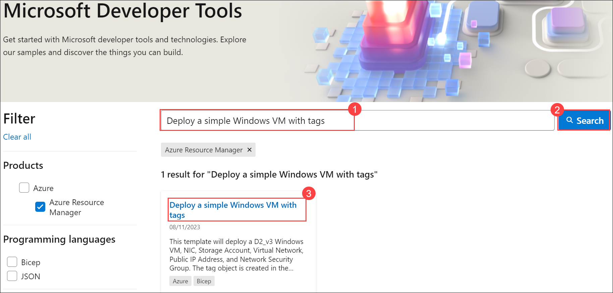
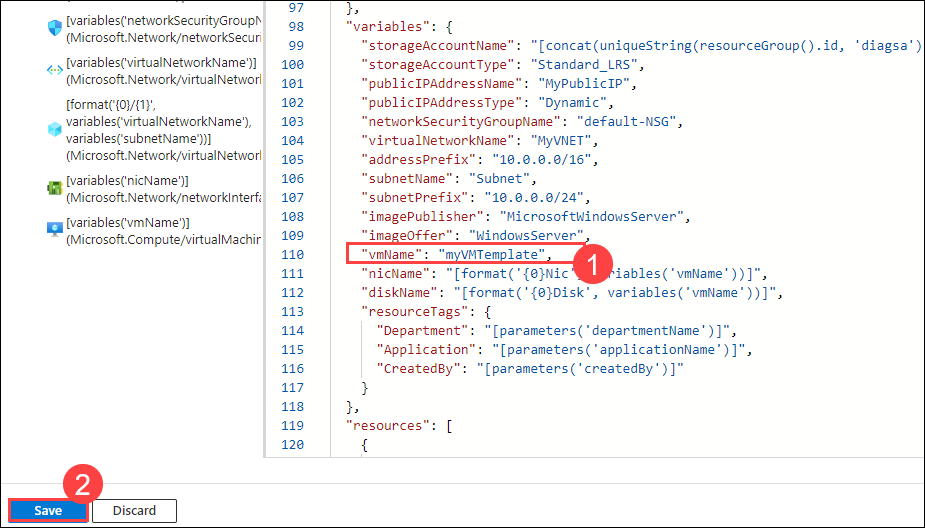
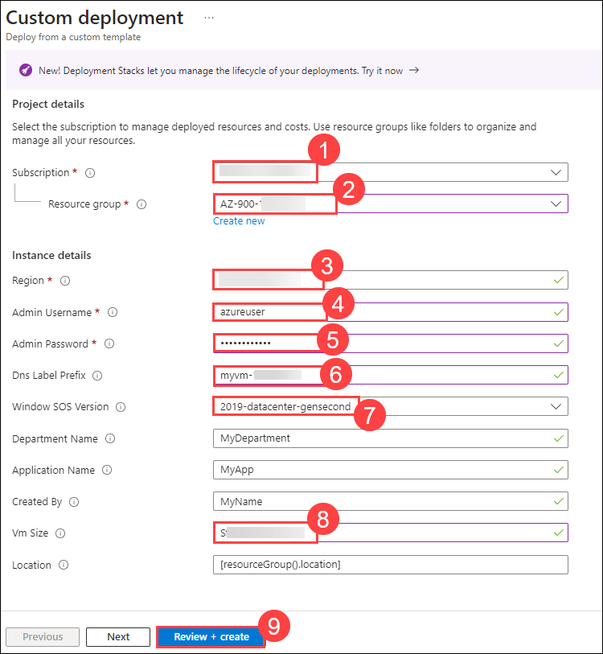
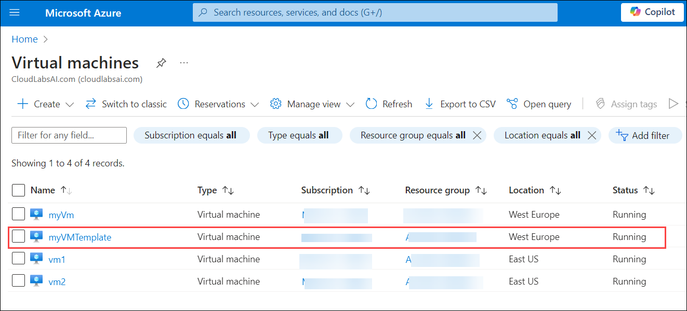

# Lab 09 - Create a VM with a Template

### Estimated Timing: 15 Minutes

## Lab Overview

In this walkthrough, we will deploy a virtual machine with a QuickStart template and examine monitoring capabilities.

## Lab Objectives

In this lab, you will be able to complete the following tasks:

+ **Task 1:** Explore the gallery and locate a template
+ **Task 2:** Verify and monitor your virtual machine deployment

## Architecture Diagram

 

### Task 1: Explore the Gallery and Locate a Template

In this task, we will browse the Azure QuickStart gallery and deploy a template that creates a virtual machine.

1. In a new tab of the **Microsoft Edge**, access the [Azure Quickstart Templates gallery](https://azure.microsoft.com/resources/templates?azure-portal=true). In the gallery, you will find many popular and recently updated templates. These templates automate the deployment of Azure resources, including the installation of popular software packages.

1. Browse through the many different types of templates that are available. Are there any templates that are of interest to you?

1. Search for **Deploy a simple Windows VM with tags (1)** in the search bar then click **Search (2)** and then select it from the results **(3)**.

    

    >**Note**: The **Deploy to Azure** button enables you to deploy the template via the Azure portal. During such deployment, you will be prompted only for a small set of configuration parameters. 

1. Click the **Deploy to Azure** button. Your browser session will be automatically redirected to the [Azure portal](http://portal.azure.com/).

    

1. If prompted, sign in to the Azure with the **Username:** <inject key="AzureAdUserEmail"></inject> and **Password:** <inject key="AzureAdUserPassword"></inject>.

1. Click **Edit template**. 

    

1. The Resource Manager template format uses the JSON format. In the template go to line number **35** and change the default value of the OS version to `2019-datacenter-gensecond`

   
   
1. Next, go to line number **110** change the VM name to `myVMTemplate` **(1)** and save the changes made to the template file by clicking on **Save (2)**.

   

3. To review the parameters and variables click on **Edit parameters file**, review the contents and  click on **Save**.
  
1. Now configure the parameters required by the template. Leave the defaults for everything else and then click **Review + create (9)**.

    | Settings| Values|
    |----|----|
    | Subscription | **Accept default subscription** (1)|
    | Resource group | **AZ-900-<inject key="DeploymentID" enableCopy="false"/>** (2) |
    | Region | Keep it as default (3) |
    | Admin username | **azureuser** (4) |
    | Admin password | **Pa$$w0rd1234** (5) |
    | DNS label prefix | **myvm-<inject key="DeploymentID" enableCopy="false"/>** (6) |
    | Windows OS version | **2019-datacenter-gensecond** (7)|
    | VM Size | **Standard_D2s_v5** (8)|
    |||
   
    

1. Click the **Create**.

1. Monitor your deployment. Wait until your deployment is completed.

### Task 2: Verify and Monitor your Virtual Machine Deployment

In this task, we will verify the virtual machine is deployed correctly. 

1. On the **Azure Portal** page, in the **Search Resources, Services, and Docs** (G+/) box at the top of the portal, enter **Virtual machines (1)**, and then select **Virtual machines (2)** under services.

    

1. Ensure that your new virtual machine, **myVMTemplate**, is listed among these virtual machines.

    

1. Select **myVMTemplate** virtual machine and on the **Overview** pane scroll down to **monitoring** tab to view monitoring data.

    

    >**Note**: The monitoring timeframe can be adjusted from one hour to 30 days.

1. Review different charts that are provided including **CPU (average)**, **Network (total)**, and **Disk bytes (total)**. 

    

1. Click on any chart. Note that you can **Add metrics (1)** and change the **chart type (2)**.

    

1. Return to the **Overview** blade.

1. Click on the **Activity log** from the left navigation pane. Activity logs record such events as the creation or modification of resources. 

    

1. Click **Add filter** and experiment with searching for different event types and operations. 

   

> **Congratulations** on completing the task! Now, it's time to validate it. Here are the steps:
> - Click on the **Validate** button for the corresponding task. If you receive a success message, you can proceed to the next task. 
> - If not, carefully read the error message and retry the step, following the instructions in the lab guide.
> - If you need any assistance, please contact us at **labs-support@spektrasystems.com**. We are available 24/7 to help.

<validation step="acb8db6a-300c-4a38-a149-41c7ba96055c" />

## Summary
In this exercise, we explored the gallery to locate a template for deploying resources and verified the deployment of a virtual machine using the selected template. We also monitored the virtual machine to ensure it was deployed correctly and functioning as expected. Throughout the exercise, we gained practical experience in using deployment templates and monitoring cloud-based virtual machines.
    
## Review
In this lab, you have:
- Explored the gallery and located a template.
- Verified and monitored your virtual machine deployment.

## Reference Link

- https://learn.microsoft.com/en-us/azure/virtual-machines/windows/ps-template  

## You have successfully completed this lab. Proceed with the next lab.
