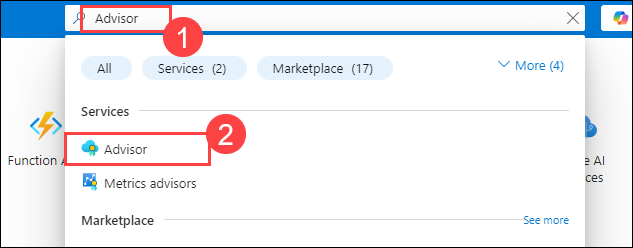
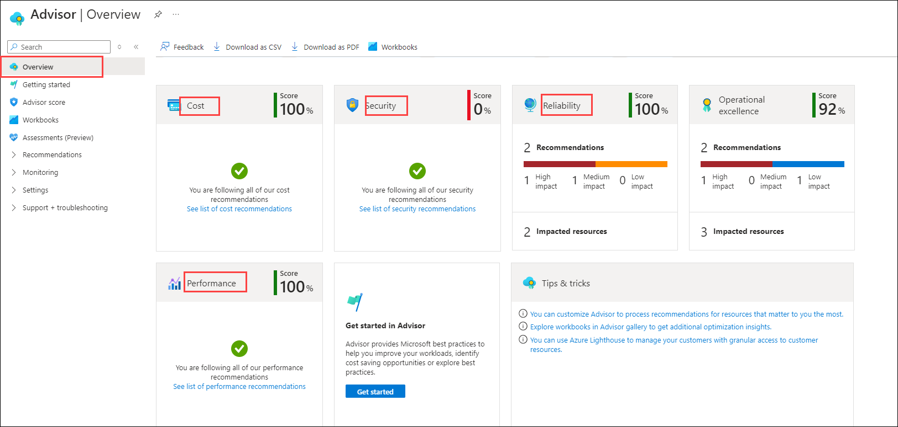

# Lab 10 - Create a VM with PowerShell 

### Estimated Timing: 15 Minutes

## Lab Overview

In this walkthrough, we will configure the Cloud Shell, use the Azure PowerShell module to create a resource group and virtual machine and review Azure Advisor recommendations.

## Lab Objectives

In this lab, you will be able to complete the following tasks:

+ **Task 1:** Configure the Cloud Shell
+ **Task 2:** Create a Virtual Machine
+ **Task 3:** Execute Commands in the Cloud Shell
+ **Task 4:** Review Azure Advisor Recommendations

## Architecture Diagram


### Task 1: Configure the Cloud Shell

In this task, we will configure Cloud Shell.

1. On the **Azure Portal**, open **Azure Cloud Shell** by clicking on the icon (as shown in the screenshot) in the top right.

    >**Note:** If you have already used it before, you can proceed to Task 2.

    

1. If you're launching Cloud Shell for the first time, you may be prompted to choose the type of shell you want to use (*Bash* or *PowerShell*). If so, select **PowerShell**.

    

1. On the **Getting started** page, select **Mount storage account (1)** and select your subscription under **Storage account subscription (2)**. Click on **Apply (3)**.

   

1. On the **Mount storage account** page, select **I want to create a storage account (1)** and then click on **Next (2)**.

   

1. On the **Create storage account** page, provide the following details and select **Create (6).**

    | Settings | Values |
    |  -- | -- |
    | Subscription | **Existing subscription (1)**|
    | Storage account name | **blob<inject key="DeploymentID" enableCopy="false"/> (2)**|
    | Resource group | **AZ-900-<inject key="DeploymentID" enableCopy="false"/> (3)** |
    | Location | **(US) East US (4)**|
    | File share | **none (5)**|

        

### Task 2: Create a Virtual Machine

In this task, we will use PowerShell to create a Resource group and a virtual machine.

1. Ensure **PowerShell** is selected in the upper-left drop-down menu of the Cloud Shell pane.

1. In the PowerShell session, within the Cloud Shell pane, get the existing Resource group.

    ```
    Get-AZResourceGroup
    ```

1. Verify your Resource group.

    ```
    Get-AzResourceGroup | Format-Table
    ```
        

1. Create a virtual machine. When prompted, provide the user as `azureuser` and the password: `Pa$$w0rd1234`. <br>This will be configured as the local administrator account on that virtual machine. Ensure that you include the tick (`) characters at the end of each line except for the last one (there should not be any tick characters if you type the entire command on a single line).

    ```
     New-AzVm `
    -ResourceGroupName "AZ-900-<inject key="DeploymentID" enableCopy="false"/>" `
    -Name "myVMPS" `
    -Location "eastus" `
    -Size "Standard_B2s" `
    -Image "MicrosoftWindowsServer:WindowsServer:2022-datacenter-azure-edition:latest" `
    -VirtualNetworkName "myVnetPS" `
    -SubnetName "mySubnetPS" `
    -SecurityGroupName "myNSGPS" `
    -PublicIpAddressName "myPublicIpPS"
    ```

        

    >**Note**: Wait for the VM to deploy before closing the PowerShell.

1. Close the PowerShell session Cloud Shell pane.

1. In the **Azure Portal**, search for **Virtual machines** and verify if the **myVMPS** is running. This may take a few minutes.

    

1. Access the new virtual machine and review the Overview and Networking settings to verify your information was correctly deployed.

> **Congratulations** on completing the task! Now, it is time to validate it. Here are the steps:
> - Click on the **Validate** button for the corresponding task. If you receive a success message, you can proceed to the next task. 
> - If not, carefully read the error message and retry the step, following the instructions in the lab guide.
> - If you need any assistance, please contact us at labs-support@spektrasystems.com. We are available 24/7 to help.

<validation step="bd6b6ab3-0b26-40e3-bddc-74cd861e563c" />

>**Note**: You can try validating the task after 3-5 minutes if validations are failing.

### Task 3: Execute Commands in the Cloud Shell

In this task, we will practice executing PowerShell commands from the Cloud Shell.

1. From the **Azure Portal**, open **Azure Cloud Shell** by clicking on the icon in the top right.

1. Ensure **PowerShell** is selected in the upper-left drop-down menu of the Cloud Shell pane.

1. Retrieve information about your virtual machine, including name, resource group, location, and status. Notice if the PowerState is **running**.

    ```
    Get-AzVM -name myVMPS -status | Format-Table -autosize
    ```
        

1. Stop the virtual machine. When prompted, confirm '**Yes**' to the action.
    ```
    Stop-AzVM -ResourceGroupName AZ-900-<inject key="DeploymentID" enableCopy="false"/> -Name myVMPS
    ```
1. For **This cmdlet will stop the specified virtual machine. Do you want to continue?** Enter **Y**.

   

1. Verify your virtual machine's state. The PowerState should now be **deallocated**. You can also verify the virtual machine's status in the portal.

    ```
    Get-AzVM -name myVMPS -status | Format-Table -autosize
    ```
        

### Task 4: Review Azure Advisor Recommendations

> **Note:** This same task is also performed within hands-on-lab for **Create a VM with Azure CLI lab**.

In this task, we will review Azure Advisor recommendations for our virtual machine.

1. On the **Search Resources, Services, and Docs** blade, search for **Advisor (1)** and select **Advisor (2)** under **Services**.

   

1. On the **Advisor** blade, select **Overview**. Notice recommendations are grouped by **Reliability, Security, Performance, and Cost**.

    

    >**Note:** Depending on your resources, your recommendations will be different, and you might get the notification "**You are following all of our performance recommendations**."

1. Select **All recommendations** under **Recommendations** from the left navigation pane. Take time to view each recommendation and suggested action.

    >**Note:** Depending on your resources, your recommendations will be different, and you might get the notification "**You are following all of our performance recommendations**."

    

1. Note that from the **Security** option under **Recommendations** in the left navigation pane, you can download the recommendations as a **CSV or PDF file**.

    

1. Note that from the **Alerts (Preview)** option in the left navigation pane, you can create alerts.

   

## Summary
In this exercise, we configured the Cloud Shell and created a virtual machine. We then executed commands within the Cloud Shell to manage resources and reviewed Azure Advisor recommendations to optimize the virtual machine setup. Throughout the exercise, we gained hands-on experience with Cloud Shell for managing Azure resources and leveraging Azure Advisor for best practice recommendations.

## Review
In this lab, you have:
- Configured the Cloud Shell.
- Created a virtual machine.
- Executed commands in the Cloud Shell.
- Reviewed Azure Advisor recommendations.

## Reference Link

- https://learn.microsoft.com/en-us/azure/virtual-machines/windows/quick-create-powershell

## You have successfully completed this lab. Proceed with the next lab.
