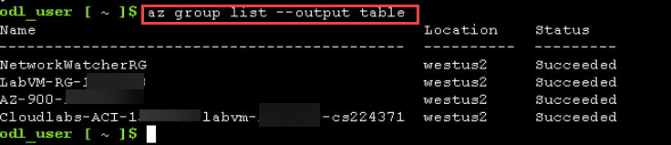
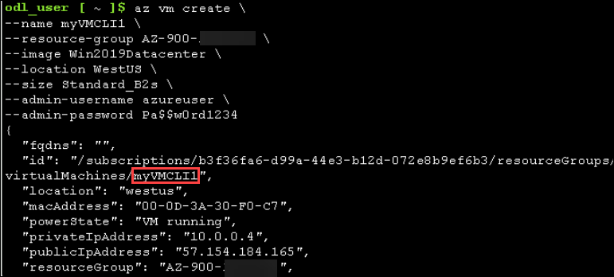
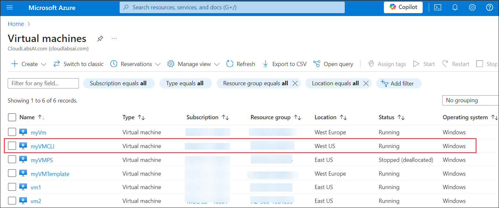
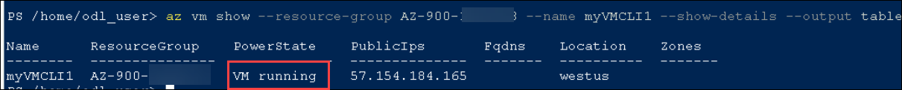
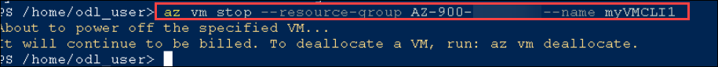
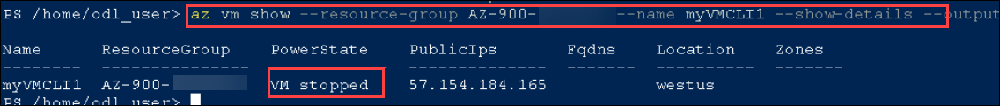
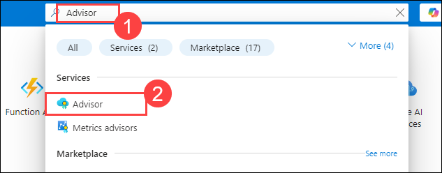
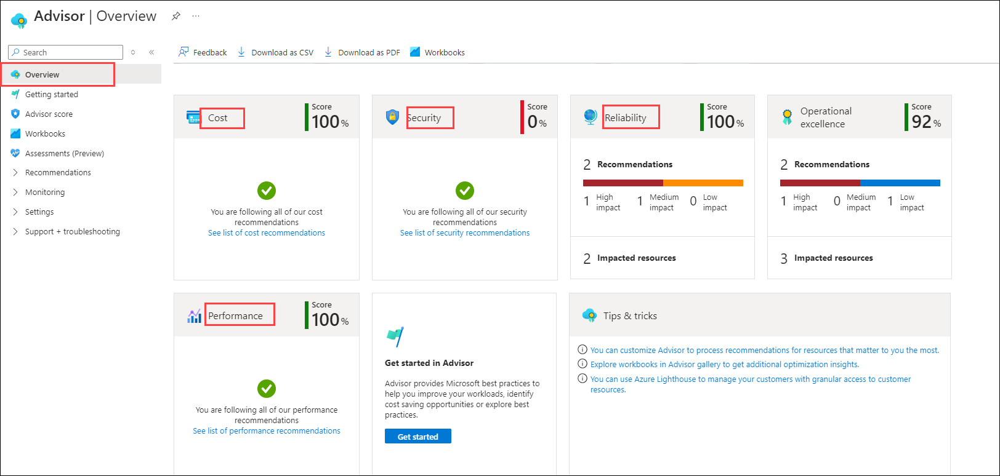
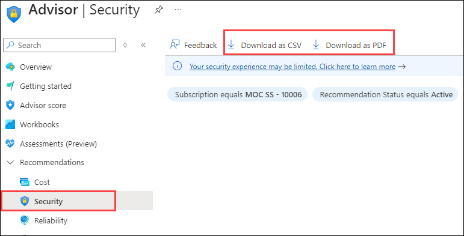
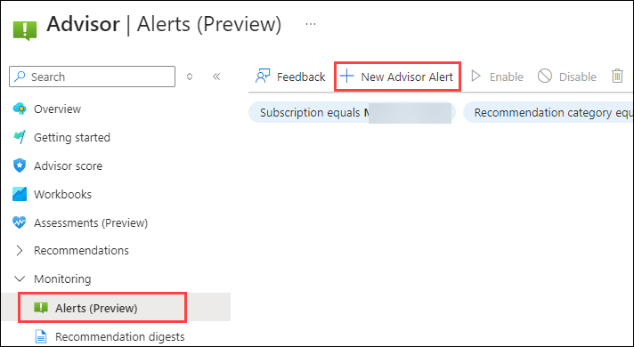

# Lab 11 - Create a VM with the CLI

### Estimated Timing: 15 Minutes

## Lab Overview

In this walkthrough, we will configure the Cloud Shell, use Azure CLI to create a virtual machine and review Azure Advisor recommendations.

## Lab Objectives

In this lab, you will be able to complete the following tasks:

+ **Task 1**: Use CLI to Create a Virtual Machine
+ **Task 2**: Execute Commands in the Cloud Shell
+ **Task 3**: Review Azure Advisor Recommendations

## Architecture Diagram


### Task 1: Use CLI to Create a Virtual Machine

In this task, we will use Azure CLI to create a resource group and a virtual machine.  

1. On the **Azure portal**, open the **Azure Cloud Shell** by clicking on the icon (as shown in the screenshot) in the top right.

    

1. In the upper-left menu of the Cloud Shell pane, select **Switch to Bash**. 

    

    >**Note:** In the **Switch to Bash in Cloud Shell** pop-up, select **Confirm**.

1. In the Bash session, within the Cloud Shell pane, get the existing resource group. 

    ```cli
    az group list
    ```

1. Format resource group listing output.

    ```cli
    az group list --output table
    ```
        

1. Create a new virtual machine. Make sure that each line except for the last one is followed by the backslash (`\`) character. If you type the whole command on the same line, do not use any backslash characters. 

    >**Note**: If you are using the command line on a Windows computer, replace the backslash (`\`) character with the caret (`^`) character.

    ```cli
    az vm create \
    --name myVMCLI1 \
    --resource-group AZ-900-<inject key="DeploymentID" enableCopy="false"/> \
    --image Win2019Datacenter \
    --location WestUS \
    --size Standard_B2s \
    --admin-username azureuser \
    --admin-password Pa$$w0rd1234
    ```    

       

    >**Note**: The command will take 2 to 3 minutes to complete. The command will create a virtual machine and various resources associated with it, such as storage, networking, and security resources. Do not continue to the next step until the virtual machine deployment is complete. 

1. When the command finishes running, in the Cloud Shell pane, close the Cloud Shell pane.

1. On the **Azure portal**, search for **Virtual machines** and verify that **myVMCLI1** is running.

    

### Task 2: Execute Commands in the Cloud Shell

In this task, we will practice executing CLI commands from the Cloud Shell. 

1. From the **Azure portal**, open **Azure Cloud Shell** by clicking on the icon in the top right.

1. Ensure **Bash** is selected in the upper-left menu of the Cloud Shell pane.

1. Retrieve information about the virtual machine you provisioned, including name, resource group, location, and status. Notice the PowerState is **running**.

    ```cli
    az vm show --resource-group AZ-900-<inject key="DeploymentID" enableCopy="false"/> --name myVMCLI1 --show-details --output table 
    ```
    

1. Stop the virtual machine. Notice the message that billing continues until the virtual machine is deallocated.

    ```cli
    az vm stop --resource-group AZ-900-<inject key="DeploymentID" enableCopy="false"/> --name myVMCLI1
    ```
        

1. Verify your virtual machine's status. The PowerState should now be **stopped**.

    ```cli
    az vm show --resource-group AZ-900-<inject key="DeploymentID" enableCopy="false"/> --name myVMCLI1 --show-details --output table 
    ```
    

1. Close the **Cloud Shell** pane.

### Task 3: Review Azure Advisor Recommendations

In this task, we will review Azure Advisor recommendations.

>**Note:** If you have completed the previous lab (Create a VM with PowerShell), then you have already performed this task. 

1. In the **Search Resources, Services, and Docs** search box, search for **Advisor (1)** and select **Advisor (2)** under **Services**.

   

1. On the **Advisor** blade, select **Overview**. Notice recommendations are grouped by **Reliability, Security, Performance, and Cost**.

    

    >**Note:** Depending on your resources, your recommendations will be different and you might get the notification "You are following all of our performance recommendations".

1. Select **All recommendations** under **Recommendations** from the left navigation pane and take time to view each recommendation and suggested actions.

    >**Note:** Depending on your resources, your recommendations will be different and you might get the notification "You are following all of our performance recommendations".

    

1. Notice that from the **Security** option under **Recommendations** in the left navigation pane, you can download the recommendations as a **CSV or PDF file**.

    

1. Notice that from the **Alerts (Preview)** in the left navigation pane, you can create alerts.

   

> **Congratulations** on completing the task! Now, it is time to validate it. Here are the steps:
> - Click on the **Validate** button for the corresponding task. If you receive a success message, you can proceed to the next task. 
> - If not, carefully read the error message and retry the step, following the instructions in the lab guide.
> - If you need any assistance, please contact us at **labs-support@spektrasystems.com**. We are available 24/7 to help.

<validation step="8f9add24-dede-42e6-97b7-e058d986c0a4" />

## Summary
In this exercise, we configured the Cloud Shell and used the CLI to create a virtual machine. We executed various commands within the Cloud Shell to manage the virtual machine and other resources. Additionally, we reviewed Azure Advisor recommendations to ensure best practices and optimize the configuration. Throughout the exercise, we gained practical experience with Cloud Shell, Azure CLI, and leveraging Azure Advisor for resource optimization.
 
## Review
In this lab, you have:
- Configured the Cloud Shell.
- Used CLI to create a virtual machine.
- Executed commands in the Cloud Shell.
- Reviewed Azure Advisor recommendations.

## Reference Link

- https://learn.microsoft.com/en-us/azure/virtual-machines/windows/quick-create-cli
   
## You have successfully completed this lab. Proceed with the next lab.
