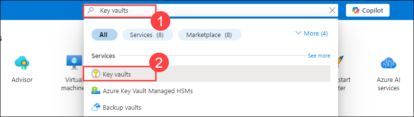
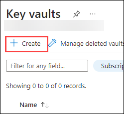
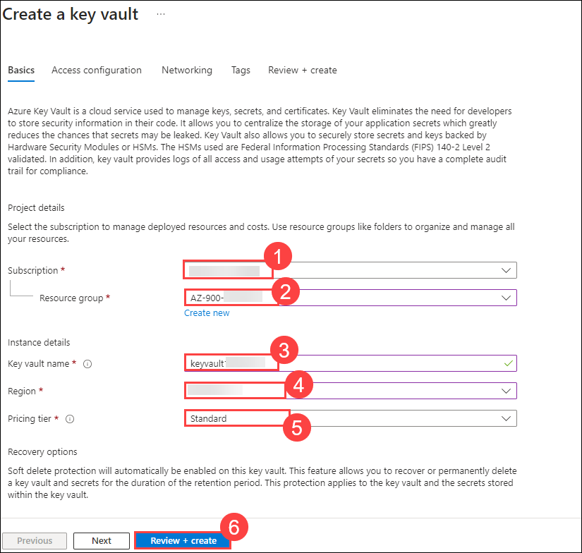
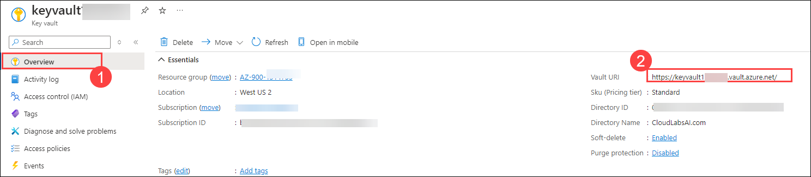
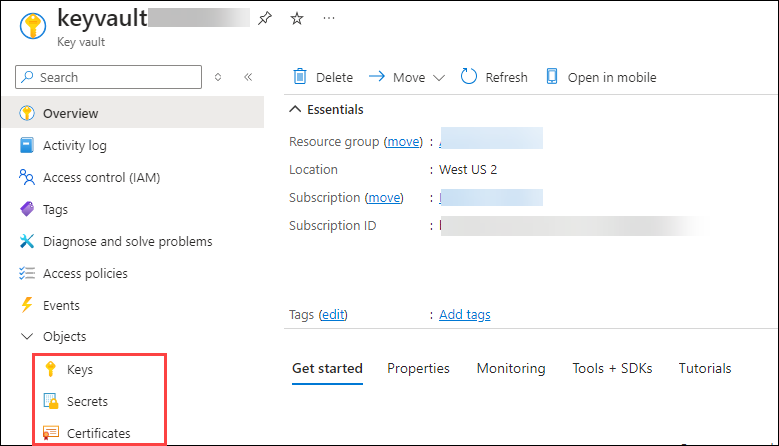
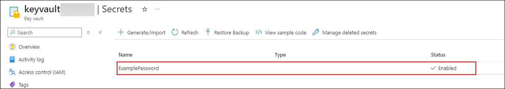
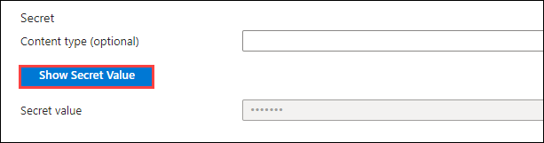

# Lab 12 - Implement Azure Key Vault

### Estimated Timing: 10 Minutes

## Lab Overview

Azure Key Vault is a cloud service for securely storing and accessing secrets. A secret is anything that you want to tightly control access to, such as API keys, passwords, certificates, or cryptographic keys. 

Secrets: Provides secure storage of secrets, such as passwords and database connection strings.

Certificates: Supports certificates, which are built on top of keys and secrets and add an automated renewal feature. Keep in mind when a certificate is created, an addressable key and secret are also created with the same name.

In this walkthrough, we will create an Azure Key Vault and then create a password secret within that Key Vault, providing a securely stored, centrally managed password for use with applications.

## Lab Objectives

In this lab, you will be able to complete the following tasks:

+ **Task 1:** Create an Azure Key Vault
+ **Task 2:** Add a secret to the Key Vault

## Architecture Diagram

### Task 1: Create an Azure Key Vault

1. On the **Azure Portal** home page, in the **Search Resources, Services, and Docs (G+/)** box at the top, enter **Key vaults (1)** and then select **Key vaults (2)** under **Services**.

   
  
1. On the **Key vaults** blade, select **+ Create**.

   

1. On the **Basics tab**, specify the following to configure the Key Vault and click on **Review + create (6)**.

    | Settings | Values | 
    | --- | --- |
    | Subscription | **Accept default subscription (1)** |
    | Resource group | **AZ-900-<inject key="DeploymentID" enableCopy="false"/> (2)**  |
    | Key vault name | **keyvault<inject key="DeploymentID" enableCopy="false" /> (3)** |
    | Location | **<inject key="Region" enableCopy="false"/> (4)** |
    | Pricing tier | **Standard (5)** |
    | | |

    
   
1. Click on **Create**. 

1. Once the new Key Vault is provisioned, click on the **Go to resource** option.

   

1. Click on the **Overview (1)** tab within the **keyvault** page and take note of the **Vault URI (2)**. Applications that use your vault through the REST API will need this URI.

   

1. Take a moment to browse through some of the other Key Vault options. Under **Objects** review, **Keys**, **Secrets**, and **Certificates**.

   
   
   >**Note**: Your Azure account is the only one authorized to perform operations on this new vault.
   
### Task 2: Add a Secret to the Key Vault
        
In this task, we will add a password to the Key Vault. 

1. Under **Objects**, click on **Secrets (1)** and then select **+ Generate/Import (2)**.

   
   
1. Configure the secret. Leave the other values at their defaults. Notice you can set an activation and expiration date. Moreover, you can also disable the secret and click on **Create (4)**.

    | Settings | Values | 
    | --- | --- |
    | Upload options | **Manual (1)** |
    | Name | **ExamplePassword (2)** |
    | Secret value | **hVFkk96 (3)** |
    | | |

    
   
1. Wait until you see the secret has been successfully created. Refresh the page once if you are not able to see the secret.

1. Once the **ExamplePassword** secret is listed, notice it has the status of **Enabled**.

   

1. Select the **ExamplePassword** secret and click on the current version.

   

1. Under **properties**, note the **Secret Identifier**. This is the URL value that you can now use with applications. It provides a centrally managed and securely stored password. 

   
   
1. Click on the **Show Secret Value** button under **Settings** to display the password that you specified earlier.

   

   
   
> **Congratulations** on completing the task! Now, it is time to validate it. Here are the steps:
> - Click on the **Validate** button for the corresponding task. If you receive a success message, you can proceed to the next task. 
> - If not, carefully read the error message and retry the step, following the instructions in the lab guide.
> - If you need any assistance, please contact us at **labs-support@spektrasystems.com**. We are available 24/7 to help.

<validation step="b7285084-2658-4a78-a80b-cc7c97f8fa45" />

## Summary
In this exercise, we created an Azure Key Vault and added a secret to it. We explored the process of securely storing sensitive information in the Key Vault and managing access to the secret. Throughout the exercise, we gained hands-on experience with Azure Key Vault for secret management and security best practices.

## Review
In this lab, you have:
- Created an Azure Key Vault.
- Added a secret to the Key Vault.

## Reference Link

- https://learn.microsoft.com/en-us/azure/key-vault/general/basic-concepts
  
## You have successfully completed this lab. Proceed with the next lab.
