# Lab 13 - Secure network traffic

## Lab overview

A Network Security Group (NSG) is a fundamental component of the network security architecture within Microsoft Azure. It acts as a basic, stateful, and centralized firewall for controlling inbound and outbound traffic to network interfaces (NIC), virtual machines (VM), and Azure Virtual Network (VNet) resources.

In this walkthrough, we will configure a network security group.

## Lab objectives

In this lab, you will complete the following tasks:

+ Task 1: Create a Virtual machine
+ Task 2: Create a network security group
+ Task 3: Configure an inbound security port rule to allow RDP
+ Task 4: Configure an outbound security port rule to deny Internet access
  
## Estimated timing: 30 minutes

## Architecture diagram

### Task 1: Create a virtual machine 

In this task, we will create a Windows Server 2019 Datacenter virtual machine. 

1. On Azure Portal page, in Search resources, services, and docs (G+/) box at the top of the portal, enter **Virtual machines (1)**, and then select **Virtual machines (2)** under services.

    

1. On the **Virtual machines** blade, click **+ Create (1)** and choose **Azure virtual machine (2)**.

     

1. On the **Basics** tab, fill in the following information (leave the defaults for everything else):

    | Settings | Values |
    |  -- | -- |
    | Subscription | **Accept default subscription (1)**|
    | Resource group | **AZ-900-<inject key="DeploymentID" enableCopy="false"/> (2)** |
    | Virtual machine name | **SimpleWinVM (3)** |
    | Region | **<inject key="Region" enableCopy="false"/> (4)**|
    | Availability option | **No infrastructure redundancy required (5)** |
    | Security type | **Standard (6)** |
    | Image | **Windows Server 2019 Datacenter -x64 Gen 2 (7)**|
    | Size | **Standard D2s v3 (8)**|
    | Username | **azureuser (9)** |
    | Password | **Pa$$w0rd1234 (10)**|
    | Confirm Password | **Pa$$w0rd1234 (11)**|
    | Public Inbound ports | **None (12)**|

     

    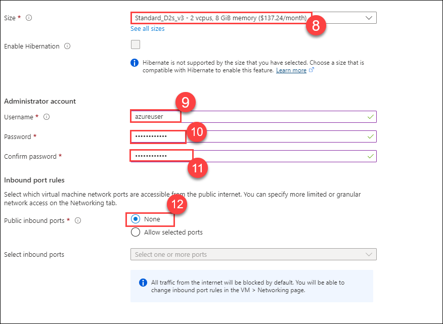         
   
1. Switch to the **Networking** tab, and configure the following setting:

    | Settings | Values |
    | -- | -- |
    | NIC network security group | **None**|
   
    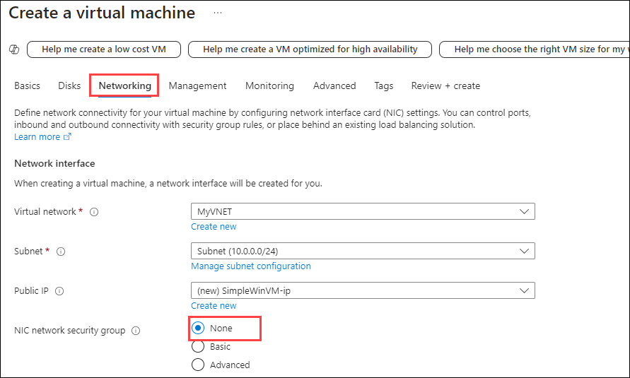         

1. Switch to the **Monitoring** tab, select the following setting and then click on **Review + create (2)** button at the bottom of the page.

    | Settings | Values |
    | -- | -- |
    | Boot diagnostics | **Disable (1)**|

    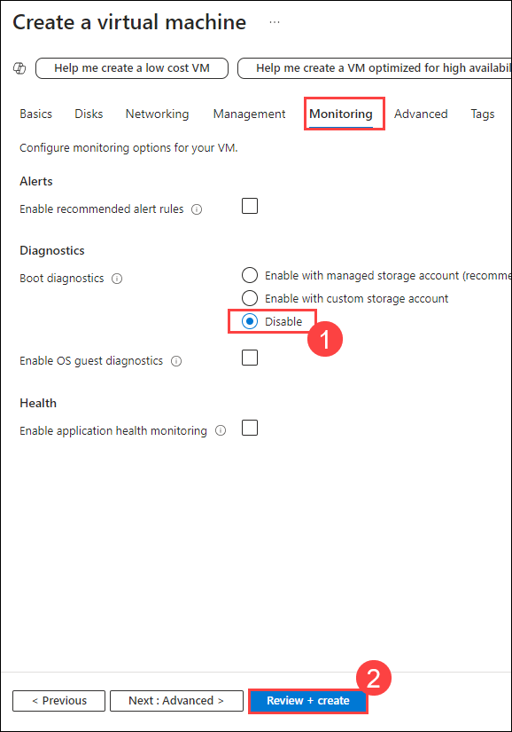            

1. Once Validation is passed click the **Create** button. It can take about five minutes to deploy the virtual machine.

    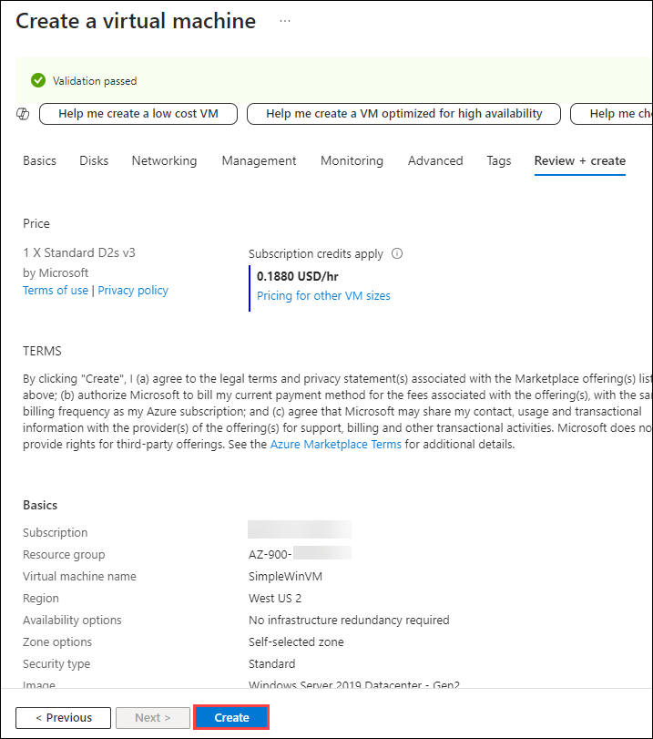         

1. Monitor the deployment. It may take a few minutes for the resource group and virtual machine to be created. 

1. From the deployment blade or from the Notification area, click **Go to resource**. 

1. On the **SimpleWinVM** virtual machine blade, click on **Network Settings (1)** under *Networking* from the left Navigation pane. Review the **Inbound port rules (2)** tab, and note that there is no **Network security group (3)** associated with the network interface of the virtual machine or the subnet to which the network interface is attached.

    >**Note**: Identify the name of the **Network interface (4)**. You will need it in the next task.

    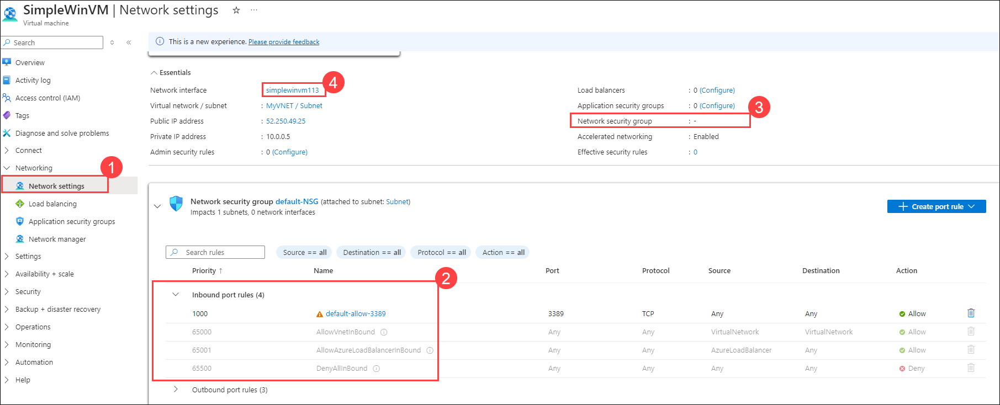             

### Task 2: Create a network security group

In this task, we will create a network security group and associate it with the network interface.

1. From the **Search resources, services, and docs** blade, search for **Network security groups (1)** and select **Network security groups (2)** from the services.

    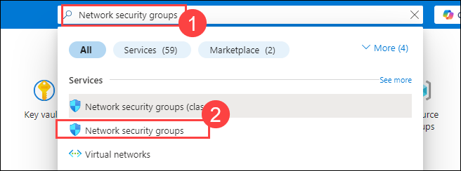    

1. Click **+ Create.**  

    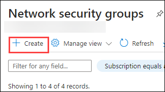    

1. On the **Basics** tab of the **Create network security group** blade, replace DeploymentId which is in environment details, specify the following settings and then click on **Review + create (5)**

    | Setting | Value |
    | -- | -- |
    | Subscription | **Choose your subscription (1)** |
    | Resource group | **AZ-900-<inject key="DeploymentID" enableCopy="false"/> (2)**|
    | Name | **myNSGSecure (3)** |
    | Region | **<inject key="Region" enableCopy="false"/> (4)**  |

    .png)

1. After the validation passed, click on **Create**. 

    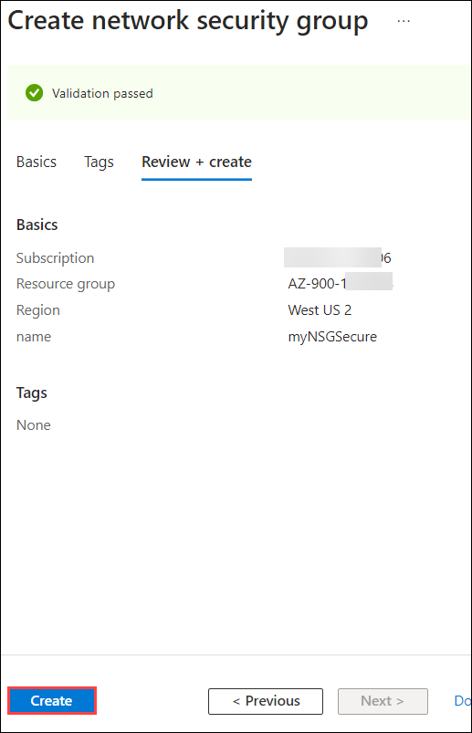    

1. After the NSG is created, click **Go to resource**.

    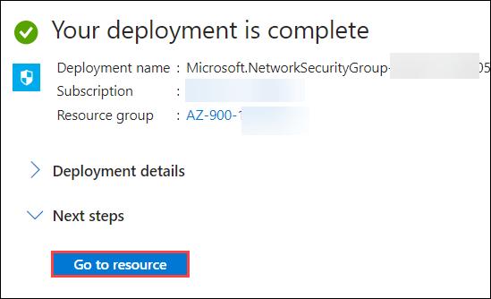    

1. Under **Settings** click **Network interfaces (1)** and then select **Associate (2)**.

    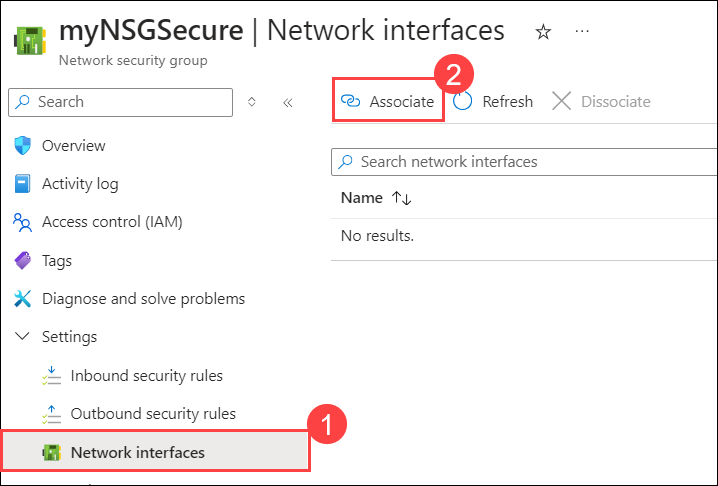    

1. Select the **network interface** you identified in the previous task **(1)** and then click **OK (2)**. 

    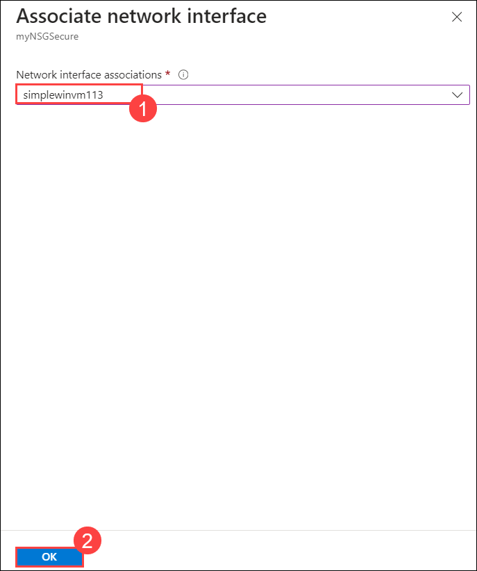    

### Task 3: Configure an inbound security port rule to allow RDP

In this task, we will allow RDP traffic to the virtual machine by configuring an inbound security port rule. 

1. In the Azure portal, navigate to the blade of the **SimpleWinVM** virtual machine. 

1. On the **Overview** pane, click **Connect (1)** drop-down and then select **Connect (2)**

    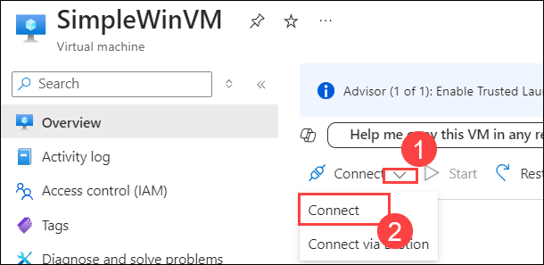    

1. On **SimpleWinVM** | Connect page, under **Native RDP** click on **Download RDP file**. 

    >**Note:** Click on **Keep** for the warning message pop-up.

    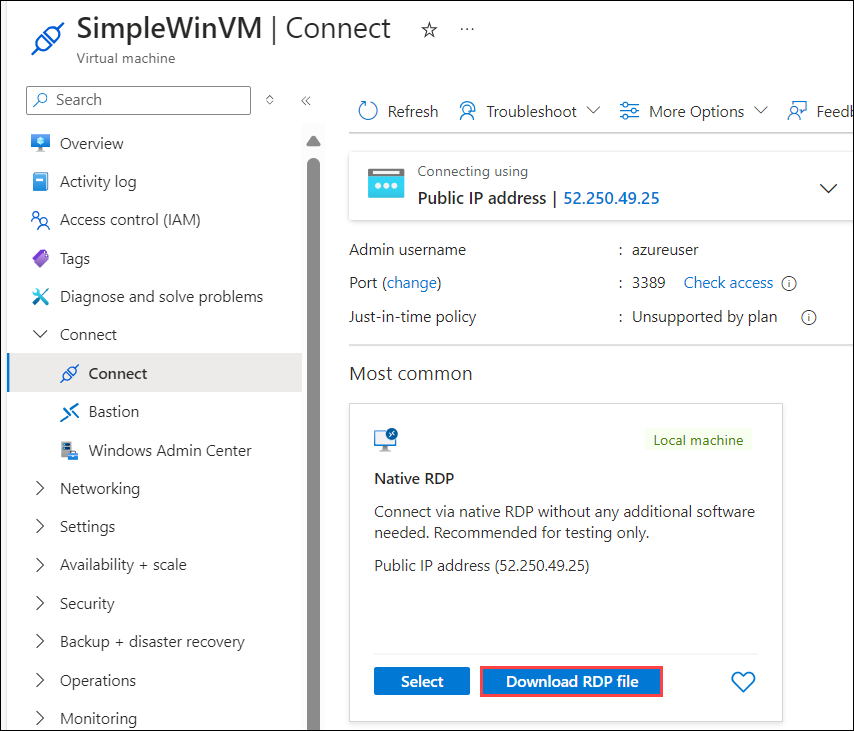    

1. Open the downloaded rdp file.
   
1. Attempt to connect to the virtual machine using RDP. By default the network security group does not allow RDP. Close the error window. 

    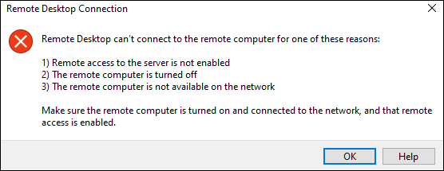

1. From the **Search resources, services, and docs** blade, search for and select **Network security groups**. Select **myNSGSecure (attached to network interface: simplewinvm<inject key="Deployment-id" enableCopy="false"/>)**. This Network security group deny all inbound traffic except traffic within the virtual network and load balancer probes.

1. From the left navigation pane, under **Settings** select **Inbound security rules**.

1. On the **Inbound security rules** tab, click **+ Add** and on the **Add inbound security rule** provide the below values to the respective settings and  Click **Add**. 

    | Setting | Value |
    | -- | -- |
    | Source | **Any**|
    | Source port ranges | **\*** |
    | Destination | **Any** |
    | Service | **Custom** |
    | Destination port ranges | **3389** |
    | Protocol | **TCP** |
    | Action | **Allow** |
    | Priority | **300** |
    | Name | **AllowRDP** |
  

1. Wait for the rule to be provisioned and then try again to RDP into the virtual machine using downloaded rdp file. This time you should be successful. Remember the user is **azureuser** and the password is **Pa$$w0rd1234**.

### Task 4: Configure an outbound security port rule to deny Internet access

In this task, we will create a NSG outbound port rule that will deny Internet access and then test to ensure the rule is working.

1. Continue in your virtual machine RDP session. If pop-up comes then select **yes**.

1. After the machine starts, open an **Internet Explorer** browser, then click on **Ok**. 

1. Open a New tab in the browser and browse to **https://www.bing.com** , and then close Internet Explorer Pop-ups. You will need to work through the IE enhanced security pop-ups. The page is displayed.

    **Note**: We will now configure a rule to deny outbound internet access. 

1. Minimize the RDP session to navigate back to **Azure Portal**.

1. In the Azure portal, navigate to the network security group, select **myNSGSecure**. 

1. From the left navigation menu, under **Settings**, select **Outbound security rules**.

1. Notice there is a rule, **AllowInternetOutbound**. This is a default rule and cannot be removed. 

1. Select **+ Add**, on the **Add outbound security rule** configure a new outbound security rule with a higher priority that will deny internet traffic. Click **Add** after configuring the below settings. 

    | Setting | Value |
    | -- | -- |
    | Source | **Any**|
    | Source port ranges | **\*** |
    | Destination | **Service Tag** |
    | Destination service tag | **Internet** |
    | Destination port ranges | **\*** |
    | Protocol | **TCP** |
    | Action | **Deny** |
    | Priority | **4000** |
    | Name | **DenyInternet** |
   
    >**Note**: Once outbound rule is created please make sure to check Destination port ranges should be as **\*** if values are reverted kindly change it to **\*** and 
     click on **Save**.

1. Return to your RDP session. 

   >**Note** : If a security alert pop-up appears, select Yes to proceed.

     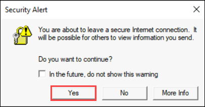

1. Browse to **https://www.bing.com**. The page should not display. You may need to work through additional IE enhanced security pop-ups. 

    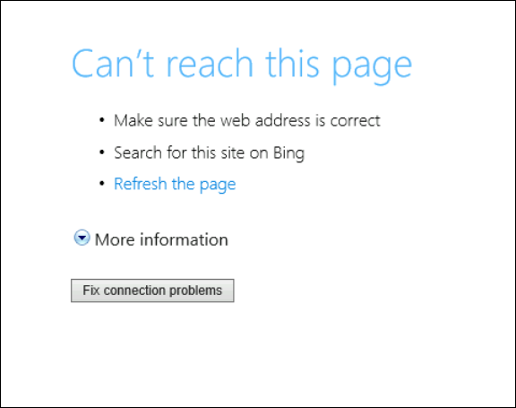

<validation step="662ed628-33c0-4e87-95b4-6fe81af2bb9a" />

> **Congratulations** on completing the task! Now, it's time to validate it. Here are the steps:
> - If you receive a success message, you can proceed to the next task.
> - If not, carefully read the error message and retry the step, following the instructions in the lab guide. 
> - If you need any assistance, please contact us at labs-support@spektrasystems.com. We are available 24/7 to help you out.

### Review
In this lab, you have completed:
- Created a virtual machine
- Created a network security group
- Configured an inbound security port rule to allow RDP
- Configure an outbound security port rule to deny Internet access

### Reference Links
- https://learn.microsoft.com/en-us/azure/virtual-network/network-security-groups-overview
- https://learn.microsoft.com/en-us/azure/virtual-network/network-security-group-how-it-works
  
## You have successfully completed this lab. Proceed with the next lab.
