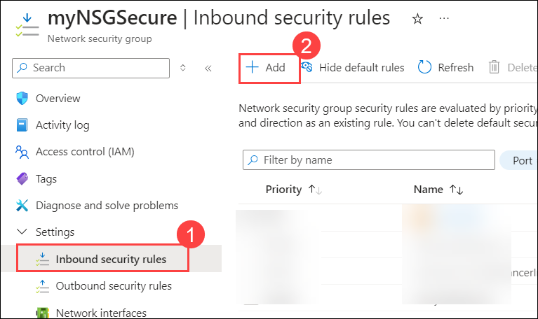

# Lab 13 - Secure Network Traffic

### Estimated Timing: 30 Minutes

## Lab Overview

A Network Security Group (NSG) is a fundamental component of the network security architecture within Microsoft Azure. It acts as a basic, stateful, and centralized firewall for controlling inbound and outbound traffic to network interfaces (NIC), virtual machines (VM), and Azure Virtual Network (VNet) resources.

In this walkthrough, we will configure a network security group.

## Lab Objectives

In this lab, you will be able to complete the following tasks:

+ **Task 1:** Create a Virtual Machine
+ **Task 2:** Create a Network Security Group
+ **Task 3:** Configure an Inbound Security Port Rule to Allow RDP
+ **Task 4:** Configure an Outbound Security Port Rule to Deny Internet Access

## Architecture Diagram

### Task 1: Create a Virtual Machine 

In this task, we will create a Windows Server 2019 Datacenter virtual machine. 

1. On the **Azure Portal** page, in the **Search Resources, Services, and Docs** (G+/) box at the top, enter **Virtual machines (1)**, and then select **Virtual machines (2)** under **Services**.

    

1. On the **Virtual machines** blade, click on **+ Create (1)** and choose **Azure Virtual Machine (2)**.

     

1. On the **Basics** tab, fill in the following information (leave the rest as default):

    | Settings | Values |
    |  -- | -- |
    | Subscription | **Accept default subscription (1)**|
    | Resource group | **AZ-900-<inject key="DeploymentID" enableCopy="false"/> (2)** |
    | Virtual machine name | **SimpleWinVM (3)** |
    | Region | **<inject key="Region" enableCopy="false"/> (4)**|
    | Availability option | **No infrastructure redundancy required (5)** |
    | Security type | **Standard (6)** |
    | Image | **Windows Server 2019 Datacenter -x64 Gen 2 (7)**|
    | Size | **Standard D2s v3 (8)**|
    | Username | **azureuser (9)** |
    | Password | **Pa$$w0rd1234 (10)**|
    | Confirm Password | **Pa$$w0rd1234 (11)**|
    | Public Inbound ports | **None (12)**|

     

             
   
1. Switch to the **Networking** tab and configure the following setting:

    | Setting | Value |
    | -- | -- |
    | NIC network security group | **None**|
   
             

1. Switch to the **Monitoring** tab, select the following setting, and then click on the **Review + create (2)** button at the bottom of the page.

    | Setting | Value |
    | -- | -- |
    | Boot diagnostics | **Disable (1)**|

                

1. Once validation is passed, click on the **Create** button. It can take about five minutes to deploy the virtual machine.

             

1. Monitor the deployment. It may take a few minutes for the resource group and virtual machine to be created. 

1. From the **Deployment** blade or from the **Notification** area, click on **Go to resource**. 

1. On the **SimpleWinVM** virtual machine blade, click on **Network settings (1)** under **Networking** from the left navigation pane. Review the **Inbound port rules (2)** tab, and note that there is no **Network security group (3)** associated with the network interface of the virtual machine or the subnet to which the network interface is attached.

    >**Note**: Identify the name of the **Network interface (4)**. You will need it in the next task.

                 

### Task 2: Create a Network Security Group

In this task, we will create a network security group and associate it with the network interface.

1. From the **Search Resources, Services, and Docs** blade, search for **Network security groups (1)** and select **Network security groups (2)** from the services.

        

1. Click on **+ Create.**  

        

1. Within the **Basics** tab of the **Create network security group** blade, replace **DeploymentId**, which is in environment details, specify the following settings, and then click on **Review + create (5).**

    | Settings | Values |
    | -- | -- |
    | Subscription | **Choose your subscription (1)** |
    | Resource group | **AZ-900-<inject key="DeploymentID" enableCopy="false"/> (2)**|
    | Name | **myNSGSecure (3)** |
    | Region | **<inject key="Region" enableCopy="false"/> (4)**  |

    .png)

1. After the validation is passed, click on **Create**. 

        

1. Once the NSG is created, click on **Go to resource**.

        

1. Under **Settings,** click on **Network interfaces (1)** and then select **Associate (2)**.

        

1. Select the **network interface** you identified in the previous task **(1)** and then click on **OK (2)**. 

        

### Task 3: Configure an Inbound Security Port Rule to Allow RDP

In this task, we will allow RDP traffic to the virtual machine by configuring an inbound security port rule. 

1. In the **Azure Portal** page, navigate to the **SimpleWinVM** virtual machine. 

1. On the **Overview** pane, click on the **Connect (1)** drop-down and then select **Connect (2).**

        

1. On the **SimpleWinVM** **| Connect** page, under **Native RDP,** click on **Download RDP file**. 

    >**Note:** Click on **Keep** for the warning message pop-up.

        

1. Open the downloaded RDP file.
   
1. Attempt to connect to the virtual machine using RDP. By default, the network security group does not allow RDP. Close the error window. 

    

1. From the **Search Resources, Services, and Docs** blade, search for and select **Network security groups**. Select **myNSGSecure (attached to network interface: simplewinvm<inject key="Deployment-id" enableCopy="false"/>)**. This network security group denies all inbound traffic except traffic within the virtual network and load balancer probes.

1. From the left navigation pane, under **Settings,** select **Inbound security rules**.

1. On the **Inbound security rules (1)** tab, click on **+ Add (2).**

        

1. On the **Add inbound security rule,** provide the below values to the respective settings and click on **Add (10)**. 

    | Settings | Values |
    | -- | -- |
    | Source | **Any (1)**|
    | Source port ranges | **\* (2)** |
    | Destination | **Any (3)** |
    | Service | **Custom (4)** |
    | Destination port ranges | **3389 (5)** |
    | Protocol | **TCP (6)** |
    | Action | **Allow (7)** |
    | Priority | **300 (8)** |
    | Name | **AllowRDP (9)** |
  
        

1. Wait for the rule to be provisioned and then try again to RDP into the virtual machine using the downloaded RDP file. This time, you should be successful. Remember the user is **azureuser**, and the password is **Pa$$w0rd1234**.

### Task 4: Configure an Outbound Security Port Rule to Deny Internet Access

In this task, we will create an NSG outbound port rule that will deny Internet access and then test to ensure the rule is working.

1. Continue in your virtual machine RDP session. If a pop-up appears, then select **yes**.

1. After the machine starts, open an **Internet Explorer** browser, then click on **OK**. 

1. Open a new tab in the browser, browse to **https://www.bing.com**, and then close Internet Explorer pop-ups. You will need to work through the IE-enhanced security pop-ups. The page is displayed.

    **Note**: We will now configure a rule to deny outbound internet access. 

1. Minimize the RDP session to navigate back to the **Azure Portal**.

1. In the **Azure Portal**, navigate to the network security group and select **myNSGSecure**. 

1. From the left navigation menu, under **Settings**, select **Outbound security rules (1)**. Notice there is a rule, **AllowInternetOutbound (2)**. This is a default rule and cannot be removed. 

        

1. Select **+ Add** on the **Add outbound security rule.**

        

1. Configure a new outbound security rule with a higher priority that will deny internet traffic. Click on **Add (11)** after configuring the below settings. 

    | Settings | Values |
    | -- | -- |
    | Source | **Any (1)**|
    | Source port ranges | **\* (2)** |
    | Destination | **Service Tag (3)** |
    | Destination service tag | **Internet (4)** |
    | Service | **Custom (5)** |
    | Destination port ranges | **\* (6)** |
    | Protocol | **TCP (7)** |
    | Action | **Deny (8)** |
    | Priority | **4000 (9)** |
    | Name | **DenyInternet (10)** |
   
          

    >**Note**: Once the outbound rule is created, please make sure to check Destination port ranges should be as **\***. If values are reverted, kindly change it to **\*** and click on **Save**.

1. Return to your RDP session. 

   >**Note**: If a security alert pop-up appears, select **Yes** to proceed.

     

1. Browse to **https://www.bing.com**. The page might not be displayed. You may need to work through additional IE-enhanced security pop-ups. 

    

> **Congratulations** on completing the task! Now, it is time to validate it. Here are the steps:
> - Click on the **Validate** button for the corresponding task. If you receive a success message, you can proceed to the next task. 
> - If not, carefully read the error message and retry the step, following the instructions in the lab guide.
> - If you need any assistance, please contact us at labs-support@spektrasystems.com. We are available 24/7 to help.

<validation step="662ed628-33c0-4e87-95b4-6fe81af2bb9a" />

## Summary
In this exercise, we created a virtual machine and a network security group (NSG). We then configured an inbound security port rule to allow RDP access to the virtual machine and an outbound security port rule to deny Internet access. Throughout the exercise, we gained hands-on experience in managing network security and controlling access to resources in a cloud environment.

## Review
In this lab, you have:
- Created a virtual machine.
- Created a network security group.
- Configured an inbound security port rule to allow RDP.
- Configure an outbound security port rule to deny Internet access.

## Reference Links
- https://learn.microsoft.com/en-us/azure/virtual-network/network-security-groups-overview
- https://learn.microsoft.com/en-us/azure/virtual-network/network-security-group-how-it-works
  
## You have successfully completed this lab. Proceed with the next lab.
