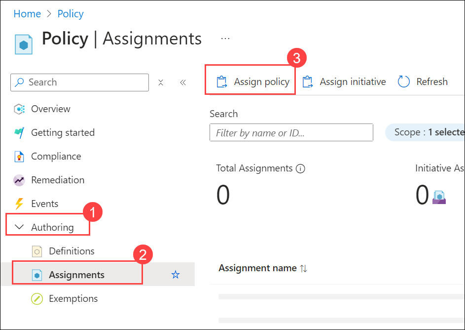
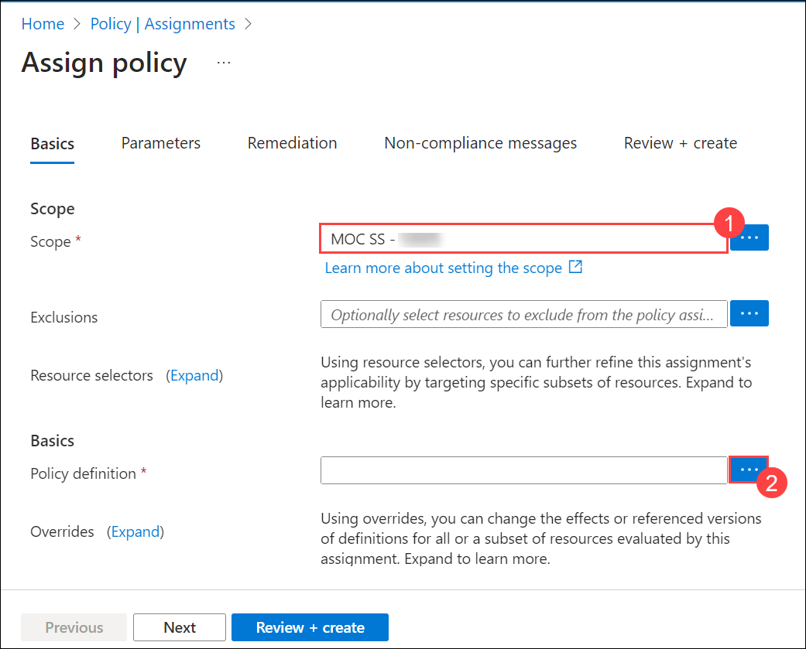
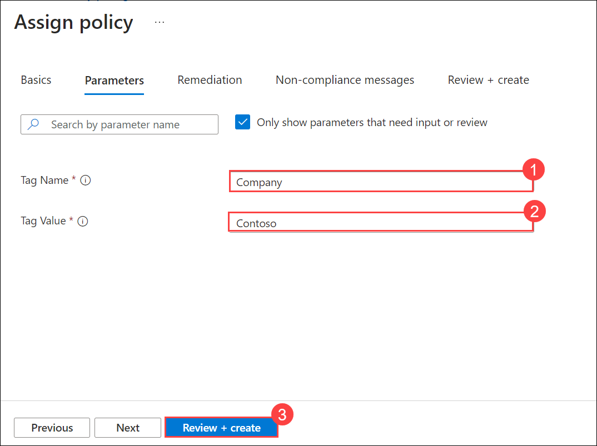
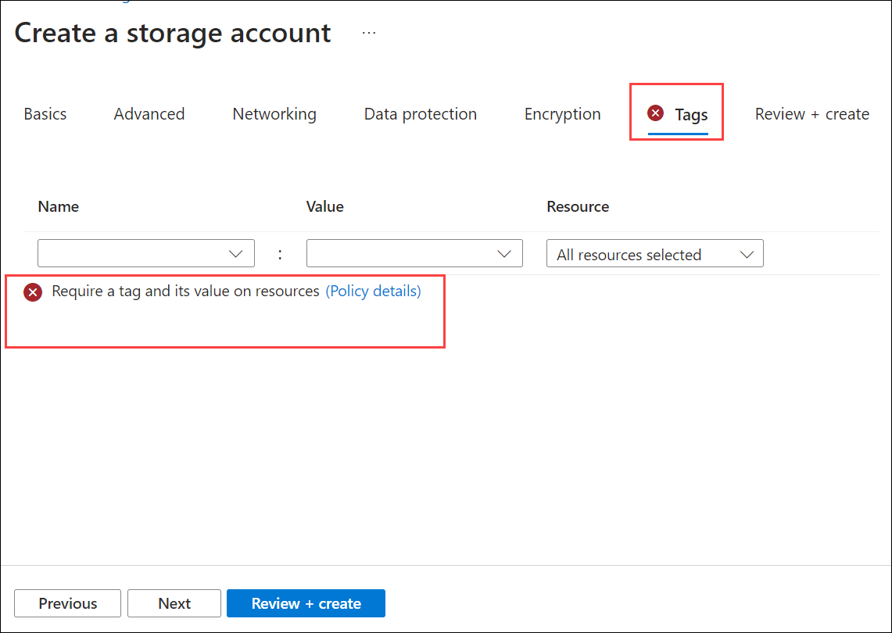
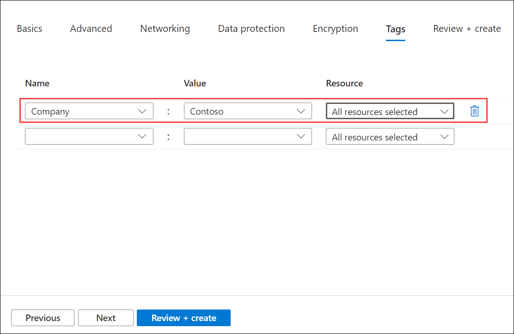

# Lab 16 - Implement Resource Tagging

### Estimated Timing: 30 Minutes

## Lab Overview

Resource tagging in Azure involves assigning metadata to Azure resources using key-value pairs called tags. These tags can provide additional information about resources, such as environment, department, cost center, owner, or any other relevant attributes. Azure resource tagging offers several benefits, including improved resource management, cost tracking, access control, and automation. 

In this walkthrough, we will create a policy assignment that requires tagging, create a storage account and test the tagging, view resources with a specified tag, and remove the tagging policy.

## Lab Objectives

In this lab, you will be able to complete the following tasks:

+ **Task 1**: Create a Policy Assignment
+ **Task 2:** Create a Storage Account to Test the Required Tagging
+ **Task 3:** View all Resources with a Specific Tag
+ **Task 4:** Delete the Policy Assignment

## Architecture Diagram

### Task 1: Create a Policy Assignment

In this task, we will configure the **Require a tag on resources** policy and assign it to our subscription. 

1. On the **Azure portal** page, within the **Search Resources, Services, and Docs** (G+/) box at the top, enter **Policy (1)** and then select **Policy (2)** under **Services**.

    

1. In the **Authoring (1)** section, click on **Assignments (2)**, and then select **Assign policy (3)** from the top of the page.

   

1. On the **Basics** tab, notice the **Scope (1)** for our policy will be subscription wide. 

1. Select the **Policy** definition **ellipsis button (2)** (end of the textbox on the right). In the **Available definition**, search and select **Require a tag and its value on resources** definition, then click on **Add**.

    

   

1. On the **Assign policy** blade, click on **Next**  to switch to the **Parameters** tab. Type in **Company (1)** for the tag name and **Contoso (2)** for the tag value. Click on **Review + create (3)**, and then subsequently click on **Create**.

    

    >**Note:** This is a simple example to demonstrate tagging. Please note that the assignment takes around 30 minutes to take effect. 
 

1. The **Require a tag and its value on resources** policy assignment is now in place. When a resource is created, it must include a tag with the **Company: Contoso Key**.

### Task 2: Create a Storage Account to Test the Required Tagging

In this task, we will create storage accounts to test the required tagging. 

1. On the **Azure portal** page, within the **Search Resources, Services, and Docs** box, search for and select **storageaccounts**. Then click on **+ Create**.

1. On the **Basics** tab of the **Create a storage account** blade, fill in the following information. Leave the rest as default.

    | Settings | Values | 
    | --- | --- |
    | Subscription | **Use your subscription** |
    | Resource group | **AZ-900-<inject key="DeploymentID" enableCopy="false"/>**  |
    | Storage account name | **blobdemo<inject key="DeploymentID" enableCopy="false"/>** |
    | Region | **<inject key="Region" enableCopy="false"/>** |
    
1. Click on **Review + create**. 

    > **Note:** We are testing to see what happens when the tag is not supplied. 

1. You will receive a validation failed message. On the **Tags** tab, note the error message stating: **Require a tag and its value on resources**. 

    

1. Provide the tagging information: 

    | Settings | Values | 
    | --- | --- |
    | Name | **Company** (may not be in the drop-down list) |
    | Value| **Contoso** (may not be in the drop-down list) |
    | | |

   

1. Click on **Review + Create** and verify that the validation was successful. Click on **Create** to deploy the storage account. 

### Task 3: View all Resources with a Specific Tag

1. On the **Azure portal** page, within the **Search Resources, Services, and Docs** box, search for and select **Tags**.

1. Note all tags and their values. Click on the **Company : Contoso** key/value pair. This will display a blade showing the newly created storage account as long as you have included the tag during its deployment. 

   

1. Click on the **Add filter** option and add the **Company** and the **Tag** key as filter categories. With the filter applied, only your storage account will be listed.

    

> **Congratulations** on completing the task! Now, it is time to validate it. Here are the steps:
> - Click on the **Validate** button for the corresponding task. If you receive a success message, you can proceed to the next task. 
> - If not, carefully read the error message and retry the step, following the instructions in the lab guide.
> - If you need any assistance, please contact us at **labs-support@spektrasystems.com**. We are available 24/7 to help.

<validation step="1abed690-3384-4756-82a5-4c5da948616c" />

### Task 4: Delete the Policy Assignment

In this task, we will remove the **Require a tag and its value on resources** policy so it does not affect our future work. 

1. On the **Azure portal** page, within the **Search Resources, Services, and Docs** box, search for and select **Policy**.

1. In the **Require a tag and its value on resources** policy entry, scroll to the right and click on the **ellipsis** button. Select **Delete assignment**.

    

1. Confirm you wish to delete the policy assignment in the **Delete assignment** dialogue box by clicking on **Yes.**

1. Now, try to create a storage account, and the policy will not block the creation.

   >**Note:** It could take a little while for the deleted policy to start working.

In this walkthrough, we created a policy assignment that required tagging, created a storage account and tested the tagging, viewed resources with a specified tag, and removed the tagging policy.

## Summary
In this exercise, we created a policy assignment to enforce tagging requirements on resources. We then created a storage account to test the required tagging and viewed all resources with a specific tag. Finally, we deleted the policy assignment to stop enforcing the tag requirement. Throughout the exercise, we gained hands-on experience with Azure Policy for resource governance and tag management.

## Review
In this lab, you have:
- Created a policy assignment.
- Created a storage account to test the required tagging.
- Viewed all resources with a specific tag.
- Deleted the policy assignment.

## Reference Links

- https://learn.microsoft.com/en-us/azure/azure-resource-manager/management/tag-resources
- https://learn.microsoft.com/en-us/azure/azure-resource-manager/management/tag-resources-portal
  
## You have successfully completed this lab. Proceed with the next lab.
