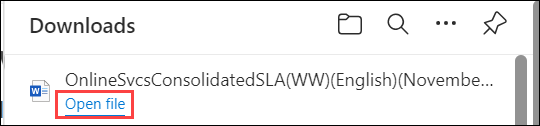

# Lab 21 - Calculate Composite SLAs

### Estimated Timing: 5 Minutes

## Lab Overview

Calculating Composite Service Level Agreements (SLAs) involves determining the overall availability or uptime of a system or service composed of multiple components, each with its own SLA. The composite SLA represents the combined reliability of all the individual components within the system.

In this walkthrough, we will determine the availability SLA of Azure services and then calculate application composite SLA-based expected availability.

Our example application consists of these Azure services. We will not go into the deep architectural configuration and considerations; the intention here is to give a high-level example.

+ **App Service**: To host the application.
+ **Azure AD B2C**: To authenticate user logins and manage profiles.
+ **Application Gateway**: To manage application access and scaling. 
+ **Azure SQL Database**: To store application data. 

## Lab Objectives

In this lab, you will be able to complete the following tasks:

+ **Task 1**: Determine the SLA Uptime Percentage Values for our Application
+ **Task 2**: Calculate the Application Composite SLA Percentage Uptime

## Architecture Diagram

### Task 1: Determine the SLA Uptime Percentage Values for our Application

1. In your Edge browser, go to the [SLA summary for Azure services](https://azure.microsoft.com/en-us/support/legal/sla/summary/) page.

1. Don't make any changes. Leave the settings as default, then select the latest version of the SLA.

   

1. It will redirect you to the downloaded Word file. Click on **Open file** to open the downloaded file, and press **CTRL + F** on your keyboard.

   

1. Type or search for **App Service**, and click on the App Service search result. Notice the **monthly Uptime Percentages** and **Service Credits**.

    

1. Then again, type or search for the **Azure Active Directory B2C** service. Now notice the **Monthly Uptime Percentages** and **Service Credits**.

1. Type or search for **Application Gateway** and click on the **Application Gateway** search result. Now notice the **Monthly Uptime Percentages** and **Service Credits**.

1. The Azure SQL database uses premium tiers but is not configured for zone redundant deployments. Locate the **Azure SQL Database** and notice the **Monthly Uptime Percentages** and **Service Credits**.

    >**Note**: There are different uptime values for different configurations and deployments of Azure SQL Database. It is important you are clear on your required uptime values when planning and costing your deployment and configuration. Small changes in uptime can have an impact on service costs as well as potentially increase complexity in configuration. Some other services that may be of interest on the Azure SLA summary web page would include **Virtual Machines**, **Storage Accounts**, and **Cosmos DB**.

### Task 2: Calculate the Application Composite SLA Percentage Uptime

1. If any of the services that comprise our application are not available, our application will not be available for users to sign in to and use. As such, the total uptime for our application consists of the following:

    - **App Service % uptime** X **Azure AD B2C % uptime** X  **Azure Application Gateway % uptime** X **Azure SQL Database % uptime** = **Total % uptime**

    - This is the SLA-based expected availability of our application with the current services and architecture.

## Summary 
In this lab, you determined the individual SLA uptime values for Azure services and calculated a composite SLA to estimate the overall availability of an application. This exercise provided insight into how combined service reliabilities impact total application uptime.

## Review
In this lab, you have:
- Determined the SLA uptime percentage values for our application.
- Calculated the Application Composite SLA percentage uptime.

## Reference Link

- https://learn.microsoft.com/en-us/azure/well-architected/reliability/metrics

## You have successfully completed this lab. Proceed with the next lab.
