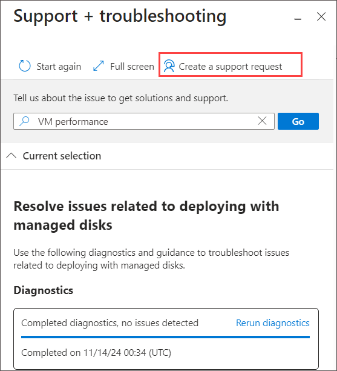

# Lab 22 - Open a Support Request

### Estimated Duration: 30 minutes

## Lab overview

Opening a support request in Azure allows users to seek assistance from Microsoft Azure support professionals for troubleshooting issues, seeking guidance, or resolving technical problems related to Azure services and resources.

In this walkthrough, we will view available support plan options and then practice creating and monitoring a new support request.

## Lab objectives

In this lab, you will complete the following tasks:

+ Task 1: View available support plan options and a technical support request
+ Task 2: Create a billing support request

## Architecture diagram

### Task 1: View available support plan options and a technical support request

1. On the Azure portal, in the  **Search resources,services and docs** blade, search for and select **Help + support**, then select **Support plans** from the left navigation pane.

1. Take a few minutes to review the different support plans. Notice what is included in the **Basic** plan. (Need to refresh the page.)

1. Go to the **Overview** option from the left navigation pane and click **+ Create a support request**. The ticket is created based on the values you specify. 

1. Under Describe your issue enter **VM performance (1)** then click on **Go (2)**

    
   
1. Under **Which service are you having issue with?** select **Virtual machine running windows (1)** and click on **Next (2)**.

     
   
1. Next select **Subscription (1)** and any **Virtual machine (2)**.

    

1. Select **None of the above (1)** and select **Problem type** : **VM performance (2)** then **Problem subtype : Disk Caching (3)**.

   

1. From the top of the page select **Create a support request** then specify the following:
     
    | Setting | Value|
    |----|--------|
    | Issue Type| **Technical** (1) |
    | Subscription | **Choose your subscription** (2) |
    | Service | **All services** (3) |
    | Service type | **Virtual Machine running Linux** (4) |
    | Resource | **General Question** (5)|
    | Summary | **Disk access is very slow for large files** (6) |
    | Problem type | **VM performance** (7) |
    | Problem subtype | **Disk throughput or IOPS are lower than expected** (8) |    

    
   
    

1. Click **Next** and in the recommended solution tab, read through the recommended solutions and click on **Return to support request**

   

1. Click **Next**. When submitting an actual support request, you would provide as much information as possible to allow for a speedy resolution of the issue. Your contact choices on this page depend on your support plan. 

    >**Note:** We will stop at this point. Do you understand how to submit a technical request?

### Task 2: Create a billing support request

1. Return to the **New support request** section and the **Basics** tab. 

    | Setting | Value|
    |----|--------|
    | Issue Type| **Billing** (1)|
    | Subscription | **Choose your subscription** (2) |
    | Summary | **Monthly charge is not correct** (3)|
    | Problem type | **Pricing** (4)|
    | Problem subtype | **Help me discover the service prices** (5) |    

    

1. Click **Next** and read through the recommended solutions and click on **Return to support request**.

1. Click **Next: Details**.  When submitting a real support request you would provide as much information as possible to allow for a speedy resolution of the issue. 

    >**Note:** We will STOP at this point. Do you understand how to submit a support request?

1. Now back in the **Help + Support** page, click **All support requests** from the left navigation pane. This is where your support requests are shown. An email is also sent to your email address containing details of the support request.

   >**Note**: Congratulations! You have viewed the available support plan options and practiced creating and monitoring a new support request.

   >**Note**: Click for more information about [**creating an Azure support ticket**](https://azure.microsoft.com/en-us/support/create-ticket).

## Summary

In this lab, you have completed:

- View available support plan options and a technical support request
- Create a billing support request

## Reference links

- https://learn.microsoft.com/en-us/azure/azure-portal/supportability/how-to-create-azure-support-request
  
- https://learn.microsoft.com/en-us/services-hub/unified/support/open-support-requests
  
## You have successfully completed this lab.
